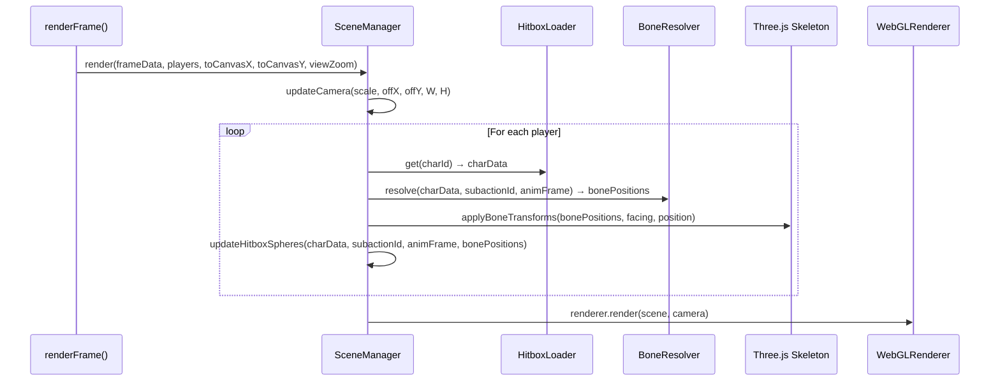
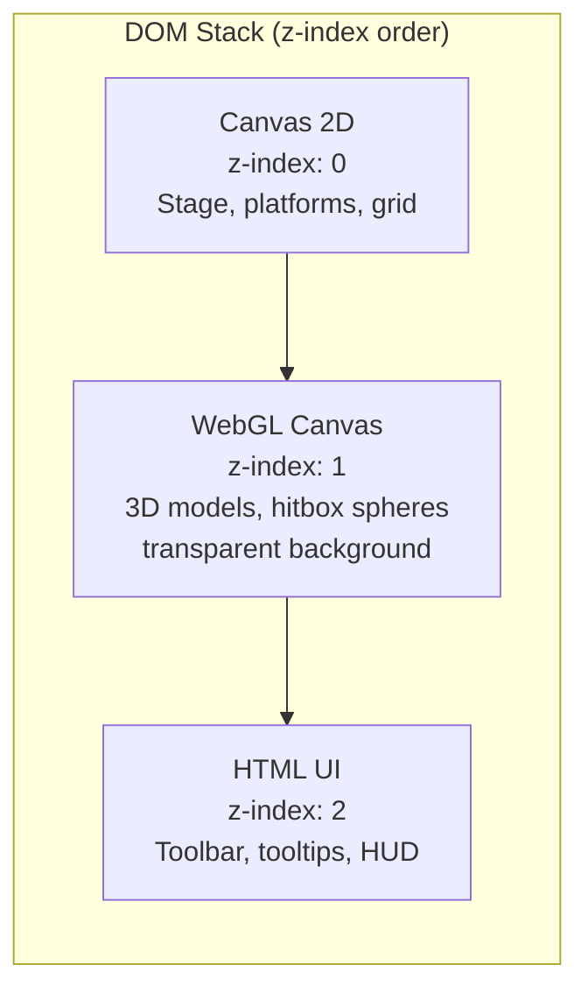

# Design Document: 3D Model Rendering

## Overview

This feature adds Three.js-powered 3D character model rendering to the Melee replay viewer (`player-notes.html`), replacing the current 2D SVG silhouettes with skinned meshes driven by FIGATREE skeletal animation data. The system overlays a WebGL canvas on top of the existing Canvas 2D layer, sharing the same coordinate system and camera parameters so that 3D characters, hitbox spheres, and the 2D stage background align seamlessly.

Three.js is lazy-loaded from `https://esm.sh/three@latest` only when the user first enables 3D mode, keeping the initial page load unchanged. The existing 2D rendering pipeline (SVG silhouettes, `HitboxRenderer`, `BoneResolver`) is preserved as a fallback for browsers without WebGL or characters without model data.

Key design decisions:
- **Overlay approach**: The Three.js canvas sits on top of the existing Canvas 2D with a transparent background, rather than replacing it. This lets the 2D stage, platforms, grid, and UI elements render unchanged underneath.
- **Orthographic camera**: Matches the existing `toCanvasX`/`toCanvasY` linear mapping exactly, so 3D objects appear at the same pixel positions as their 2D counterparts.
- **Coordinate system**: Melee Y→Three.js Y (vertical), Melee Z→Three.js X (forward/side-view), Melee X→Three.js Z (lateral/into screen). One Three.js unit = one Melee game unit.
- **Texture support**: The model extractor already has access to texture data via `dat_tools`. The design supports textures as the primary material, with a toon shader fallback when textures are unavailable. Texture extraction will be added to the model extractor, outputting decoded RGBA data as PNG files alongside the model JSON.
- **Toon shader fallback**: Simple cel-shaded material with outlines when textures are not available. Per-port coloring for player distinction.
- **Shared bone transforms**: The `Animation_Driver` reads the same `boneFrames` data from `hitbox-data/*.json` that `BoneResolver` uses, ensuring model pose and hitbox positions are always in sync.

## Architecture

```mermaid
graph TB
    subgraph "Existing 2D Layer"
        RV[player-notes.html<br/>renderFrame]
        C2D[Canvas 2D<br/>Stage, Grid, UI]
        HR[HitboxRenderer]
        BR[BoneResolver]
        HL[HitboxLoader]
    end

    subgraph "New 3D Layer"
        SM[scene-manager.js<br/>SceneManager]
        ML[model-loader.js<br/>ModelLoader]
        MB[mesh-builder.js<br/>MeshBuilder]
        THREE[Three.js<br/>esm.sh CDN]
        WGL[WebGL Canvas<br/>Transparent overlay]
    end

    subgraph "Data Sources"
        MD[(model-data/*.json<br/>vertices, normals, UVs,<br/>indices, bones, weights)]
        TX[(model-data/textures/*.png<br/>decoded RGBA textures)]
        HD[(hitbox-data/*.json<br/>boneFrames, hitboxes)]
    end

    RV -->|"renderFrame()"| C2D
    RV -->|"3D mode: sceneManager.render()"| SM
    SM --> WGL
    SM --> THREE
    ML -->|"fetch"| MD
    ML -->|"fetch"| TX
    ML -->|"character ID mapping"| HL
    MB -->|"builds SkinnedMesh"| THREE
    SM -->|"per-frame bone update"| HL
    HL -->|"boneFrames data"| BR

    RV -->|"toggle 2D/3D"| SM
    SM -->|"hitbox spheres"| THREE
    WGL ---|"overlays"| C2D

    style SM fill:#2d5a27
    style ML fill:#2d5a27
    style MB fill:#2d5a27
    style WGL fill:#1a3a5c
```



### Data Flow: Per-Frame Rendering



### Canvas Overlay Architecture



The WebGL canvas is positioned absolutely on top of the Canvas 2D element using CSS `position: absolute` with matching dimensions. The WebGLRenderer is configured with `alpha: true` and `premultipliedAlpha: false` so that areas without 3D geometry are fully transparent, letting the 2D stage rendering show through.

## Components and Interfaces

### model-loader.js — ModelLoader

Fetches and caches per-character 3D model JSON from `model-data/*.json`. Mirrors the `HitboxLoader` pattern (same character name mapping, same cache/pending promise pattern). Also handles loading texture images when available.

```javascript
export default class ModelLoader {
    constructor(basePath = 'model-data') {}

    /**
     * Fetch and cache model data for a character.
     * @param {number} charId - Slippi character ID (0-25)
     * @returns {Promise<ModelJSON|null>} Parsed model data, or null on failure
     */
    async load(charId) {}

    /**
     * Synchronous cache lookup.
     * @param {number} charId
     * @returns {ModelJSON|null}
     */
    get(charId) {}

    /**
     * Preload models for multiple characters in parallel.
     * @param {number[]} charIds
     * @returns {Promise<void>}
     */
    async preloadAll(charIds) {}

    /**
     * Load texture image for a character (if available).
     * @param {number} charId
     * @returns {Promise<HTMLImageElement|null>}
     */
    async loadTexture(charId) {}
}
```

### scene-manager.js — SceneManager

Initializes and manages the Three.js scene, camera, renderer, and per-frame rendering. This is the main orchestrator for the 3D layer.

```javascript
export default class SceneManager {
    /**
     * @param {HTMLCanvasElement} overlayCanvas - The WebGL canvas element
     */
    constructor(overlayCanvas) {}

    /**
     * Lazy-load Three.js and initialize the WebGL renderer, scene, camera, lights.
     * @returns {Promise<boolean>} true if initialization succeeded
     */
    async init() {}

    /**
     * Resize the renderer to match the given dimensions.
     * @param {number} width - Canvas width in CSS pixels
     * @param {number} height - Canvas height in CSS pixels
     */
    resize(width, height) {}

    /**
     * Update the orthographic camera to match the current 2D viewport.
     *
     * The existing 2D renderer uses:
     *   toCanvasX(x) = x * scale + offX
     *   toCanvasY(y) = -y * scale + offY
     *
     * The orthographic camera is configured so that the same game-unit
     * coordinates produce the same pixel positions on the WebGL canvas.
     *
     * @param {number} scale - Current canvas scale (baseScale * viewZoom)
     * @param {number} offX - X offset from toCanvasX computation
     * @param {number} offY - Y offset from toCanvasY computation
     * @param {number} canvasW - Canvas width in device pixels
     * @param {number} canvasH - Canvas height in device pixels
     */
    updateCamera(scale, offX, offY, canvasW, canvasH) {}

    /**
     * Add or update a character mesh in the scene.
     * @param {string} playerKey - Unique player identifier
     * @param {object} meshData - Built SkinnedMesh from MeshBuilder
     */
    setCharacterMesh(playerKey, meshData) {}

    /**
     * Apply bone transforms to a character's skeleton for the current frame.
     * @param {string} playerKey - Player identifier
     * @param {Map<number, {x,y,zDirX,zDirY}>} bonePositions - From BoneResolver
     * @param {number} gameX - Character world X position
     * @param {number} gameY - Character world Y position
     * @param {number} facing - 1 or -1
     * @param {number} charScale - Character scale factor
     */
    updatePose(playerKey, bonePositions, gameX, gameY, facing, charScale) {}

    /**
     * Update hitbox sphere meshes for a player.
     * @param {string} playerKey
     * @param {object[]} activeHitboxes - Active hitbox data
     * @param {Map} bonePositions
     * @param {number} charX, charY, facing, charScale
     */
    updateHitboxSpheres(playerKey, activeHitboxes, bonePositions,
                        charX, charY, facing, charScale) {}

    /**
     * Update hurtbox sphere meshes for a player.
     * @param {string} playerKey
     * @param {object[]} hurtboxes - Hurtbox definitions from charData
     * @param {Map} bonePositions
     * @param {number} charX, charY, facing, charScale
     * @param {number} hurtboxState - 0=vulnerable, non-zero=invincible
     */
    updateHurtboxSpheres(playerKey, hurtboxes, bonePositions,
                         charX, charY, facing, charScale, hurtboxState) {}

    /**
     * Render the scene. Called once per frame from renderFrame().
     */
    render() {}

    /**
     * Perform raycasting from mouse position for hitbox hover tooltips.
     * @param {number} mouseX - Mouse X in canvas CSS pixels
     * @param {number} mouseY - Mouse Y in canvas CSS pixels
     * @returns {{damage,angle,kbg,bkb,id}|null}
     */
    hitTest(mouseX, mouseY) {}

    /**
     * Remove all character meshes and hitbox spheres. Called on replay unload.
     */
    clear() {}

    /**
     * Dispose all Three.js resources (geometries, materials, textures).
     * Called when switching to 2D mode or unloading.
     */
    dispose() {}
}
```

### mesh-builder.js — MeshBuilder

Constructs Three.js `SkinnedMesh` objects from model JSON data. Stateless utility module.

```javascript
/**
 * Build a Three.js SkinnedMesh from model JSON data.
 * @param {object} THREE - The Three.js module (passed in to avoid import dependency)
 * @param {ModelJSON} modelData - Parsed model-data/*.json
 * @param {object} options - { color: 0xRRGGBB, opacity: number, texture: HTMLImageElement|null }
 * @returns {{ mesh: THREE.SkinnedMesh, skeleton: THREE.Skeleton, boneMap: Map<number, THREE.Bone> }}
 */
export function buildCharacterMesh(THREE, modelData, options = {}) {}

/**
 * Create a reusable hitbox sphere mesh.
 * @param {object} THREE
 * @param {number} colorHex - Sphere color
 * @param {number} opacity - 0-1
 * @returns {THREE.Mesh}
 */
export function createHitboxSphere(THREE, colorHex, opacity = 0.4) {}

/**
 * Create the toon material with outline effect (fallback when no texture).
 * @param {object} THREE
 * @param {number} color - Base color hex
 * @param {number} opacity
 * @returns {THREE.Material}
 */
export function createToonMaterial(THREE, color, opacity = 0.85) {}

/**
 * Create a textured material from decoded character texture.
 * @param {object} THREE
 * @param {HTMLImageElement} textureImage - Decoded texture image
 * @param {number} opacity
 * @returns {THREE.Material}
 */
export function createTexturedMaterial(THREE, textureImage, opacity = 0.92) {}
```


## Data Models

### Model JSON Schema: `model-data/{character}.json`

This is the existing format output by the Rust model extractor (`model-extractor/src/main.rs`). The data is already extracted and committed for all 26 characters.

```javascript
{
  "character": "fox",                    // Character name
  "vertices": [[x, y, z], ...],         // Vertex positions (float32 × 3)
  "normals": [[nx, ny, nz], ...],       // Vertex normals (float32 × 3)
  "uvs": [[u, v], ...],                 // UV coordinates (float32 × 2)
  "indices": [i0, i1, i2, ...],         // Triangle indices (uint16)
  "bones": [                            // Skeleton hierarchy
    {
      "parent": null | boneIndex,       // Parent bone index (null for root)
      "transform": [m00..m15]           // 4×4 base transform (column-major float32[16])
    },
    // ... ~30-80 bones per character
  ],
  "bone_weights": [                     // Per-vertex skinning weights
    {
      "bones": [b0, b1, b2, b3],       // Bone indices (uint32 × 4)
      "weights": [w0, w1, w2, w3]      // Weights (float32 × 4, sum to 1.0)
    },
    // ... one per vertex
  ],
  "inv_bind_matrices": [               // Inverse bind matrices per bone
    [m00..m15],                         // 4×4 column-major float32[16]
    // ... one per bone
  ]
}
```

### Texture Data (Future Enhancement — Design for Now)

Textures will be extracted by extending the model extractor to decode GX texture formats (CMPR, I4, I8, IA4, IA8, RGB565, RGB5A3, RGBA8) using `dat_tools`' existing texture decoding. Output as PNG files:

```
model-data/textures/fox.png        # Primary texture atlas
model-data/textures/fox_1.png      # Additional texture pages (if any)
```

The `ModelLoader` will attempt to load `model-data/textures/{character}.png` alongside the JSON. If the texture file exists, `MeshBuilder` applies it using the UV coordinates from the model JSON. If not found, it falls back to the toon shader.

The model JSON may be extended with an optional `textures` array:
```javascript
{
  // ... existing fields ...
  "textures": [                        // Optional — texture metadata
    {
      "file": "textures/fox.png",      // Relative path from model-data/
      "width": 256,
      "height": 256,
      "format": "CMPR"                 // Original GX format (informational)
    }
  ]
}
```

### Hitbox JSON Schema (Existing — Unchanged)

The `hitbox-data/{character}.json` files are already extracted and used by the 2D renderer. The 3D system reads the same data:
- `subactions[id].boneFrames` — per-frame bone world positions for skeletal animation
- `subactions[id].hitboxes` — hitbox events with bone attachment, offset, size, damage
- `hurtboxes` — hurtbox definitions with bone attachment and offset
- `bones` — skeleton tree with rest-pose positions
- `scale` — character model scale factor

### Coordinate System Mapping

Melee uses a right-handed coordinate system where the game is viewed from the side:
- **Melee X**: Lateral (into/out of screen in side-view) — collapsed in 2D
- **Melee Y**: Vertical (up/down)
- **Melee Z**: Forward (left/right in side-view)

Three.js uses a right-handed Y-up coordinate system. The mapping:

| Melee Axis | Three.js Axis | Role |
|-----------|--------------|------|
| X (lateral) | Z | Depth (into screen) |
| Y (vertical) | Y | Vertical |
| Z (forward) | X | Horizontal (side-view) |

The model extractor outputs vertices in Melee's coordinate system. The `MeshBuilder` swizzles them during geometry construction:
```javascript
// For each vertex [mx, my, mz] from model JSON:
threeX = mz;  // Melee forward → Three.js X (horizontal)
threeY = my;  // Melee vertical → Three.js Y (vertical)
threeZ = mx;  // Melee lateral → Three.js Z (depth)
```

The same swizzle applies to normals and bone transforms.

### Orthographic Camera Derivation

The existing 2D renderer computes:
```javascript
const scale = baseScale * viewZoom;
const offX = W/2 - (stageCenterX + viewPanX) * scale;
const offY = H/2 + (stageCenterY + viewPanY) * scale;
const toCanvasX = x => x * scale + offX;
const toCanvasY = y => -y * scale + offY;
```

To match this with an orthographic camera, we derive the camera frustum from the canvas dimensions and the scale/offset:
```javascript
// Game-space bounds visible on canvas:
const left   = (0 - offX) / scale;        // = -W/(2*scale) + stageCenterX + viewPanX
const right  = (W - offX) / scale;        // =  W/(2*scale) + stageCenterX + viewPanX
const top    = -(0 - offY) / scale;       // =  H/(2*scale) + stageCenterY + viewPanY
const bottom = -(H - offY) / scale;       // = -H/(2*scale) + stageCenterY + viewPanY

camera.left = left;
camera.right = right;
camera.top = top;
camera.bottom = bottom;
camera.near = -1000;  // Large range to capture all depth
camera.far = 1000;
camera.position.set(0, 0, 500);  // Looking along -Z (into screen)
camera.updateProjectionMatrix();
```

This ensures that a Three.js object at position `(gameX_three, gameY, 0)` — where `gameX_three` is the Melee Z coordinate — renders at the same pixel as `toCanvasX(gameX)` / `toCanvasY(gameY)`.

## Algorithmic Pseudocode

### Algorithm 1: SkinnedMesh Construction

```javascript
function buildCharacterMesh(THREE, modelData, options) {
    // 1. Build BufferGeometry
    const geometry = new THREE.BufferGeometry();
    const vertCount = modelData.vertices.length;

    // Swizzle vertices: Melee [X,Y,Z] → Three.js [Z,Y,X]
    const positions = new Float32Array(vertCount * 3);
    const normals = new Float32Array(vertCount * 3);
    const uvs = new Float32Array(vertCount * 2);
    const skinIndices = new Uint16Array(vertCount * 4);
    const skinWeights = new Float32Array(vertCount * 4);

    for (let i = 0; i < vertCount; i++) {
        const [mx, my, mz] = modelData.vertices[i];
        positions[i*3]   = mz;  // Three.js X = Melee Z
        positions[i*3+1] = my;  // Three.js Y = Melee Y
        positions[i*3+2] = mx;  // Three.js Z = Melee X

        const [nx, ny, nz] = modelData.normals[i];
        normals[i*3]   = nz;
        normals[i*3+1] = ny;
        normals[i*3+2] = nx;

        uvs[i*2]   = modelData.uvs[i][0];
        uvs[i*2+1] = modelData.uvs[i][1];

        const bw = modelData.bone_weights[i];
        skinIndices[i*4]   = bw.bones[0];
        skinIndices[i*4+1] = bw.bones[1];
        skinIndices[i*4+2] = bw.bones[2];
        skinIndices[i*4+3] = bw.bones[3];
        skinWeights[i*4]   = bw.weights[0];
        skinWeights[i*4+1] = bw.weights[1];
        skinWeights[i*4+2] = bw.weights[2];
        skinWeights[i*4+3] = bw.weights[3];
    }

    geometry.setAttribute('position', new THREE.BufferAttribute(positions, 3));
    geometry.setAttribute('normal', new THREE.BufferAttribute(normals, 3));
    geometry.setAttribute('uv', new THREE.BufferAttribute(uvs, 2));
    geometry.setAttribute('skinIndex', new THREE.BufferAttribute(skinIndices, 4));
    geometry.setAttribute('skinWeight', new THREE.BufferAttribute(skinWeights, 4));
    geometry.setIndex(Array.from(modelData.indices));

    // 2. Build Skeleton
    const bones = [];
    const boneMap = new Map();
    for (let i = 0; i < modelData.bones.length; i++) {
        const bone = new THREE.Bone();
        bone.name = `bone_${i}`;
        bones.push(bone);
        boneMap.set(i, bone);

        // Apply base transform (swizzled)
        const m = new THREE.Matrix4();
        m.fromArray(swizzleMatrix(modelData.bones[i].transform));
        bone.applyMatrix4(m);
    }

    // Set parent-child relationships
    for (let i = 0; i < modelData.bones.length; i++) {
        const parentIdx = modelData.bones[i].parent;
        if (parentIdx != null) {
            bones[parentIdx].add(bones[i]);
        }
    }

    const skeleton = new THREE.Skeleton(bones);

    // Apply inverse bind matrices (swizzled)
    for (let i = 0; i < modelData.inv_bind_matrices.length; i++) {
        const ibm = new THREE.Matrix4();
        ibm.fromArray(swizzleMatrix(modelData.inv_bind_matrices[i]));
        skeleton.boneInverses[i] = ibm;
    }

    // 3. Create material (textured or toon fallback)
    let material;
    if (options.texture) {
        material = createTexturedMaterial(THREE, options.texture, options.opacity ?? 0.92);
    } else {
        material = createToonMaterial(THREE, options.color ?? 0x888888, options.opacity ?? 0.85);
    }

    // 4. Assemble SkinnedMesh
    const mesh = new THREE.SkinnedMesh(geometry, material);
    mesh.add(bones[0]); // Add root bone to mesh
    mesh.bind(skeleton);

    return { mesh, skeleton, boneMap };
}
```

**Preconditions:**
- `modelData` has matching array lengths for vertices, normals, uvs, bone_weights
- `modelData.indices` contains valid indices into the vertex arrays
- All bone parent references form a valid tree (no cycles)

**Postconditions:**
- Returns a renderable SkinnedMesh with correct skinning attributes
- Skeleton hierarchy matches the model's bone tree
- Coordinate system is swizzled from Melee to Three.js conventions

### Algorithm 2: Per-Frame Bone Transform Application

```javascript
function applyBoneTransforms(skeleton, boneMap, bonePositions, gameX, gameY, facing, charScale) {
    // The bonePositions map contains 2D projected positions from BoneResolver:
    //   bone.x = Melee Z component (forward) → Three.js X
    //   bone.y = Melee Y component (vertical) → Three.js Y
    //
    // For the 3D skeleton, we need to set each bone's world position.
    // Since bonePositions are pre-computed world positions (character-local),
    // we set the root transform and then update each bone's position directly.

    const rootBone = skeleton.bones[0];

    // Set root position to character world position (swizzled)
    // gameX in Melee = Z forward → Three.js X
    // gameY in Melee = Y vertical → Three.js Y
    rootBone.position.set(gameX, gameY, 0);

    // Apply facing direction: mirror along X axis
    rootBone.scale.set(facing * charScale, charScale, charScale);

    // For each bone with position data, set its world position
    // This overrides the skeleton's hierarchical transforms with
    // the pre-computed positions from the FIGATREE animation data
    for (const [boneId, pos] of bonePositions) {
        const bone = boneMap.get(boneId);
        if (!bone) continue;

        // bonePositions are in character-local space
        // pos.x = Melee Z (forward) → Three.js local X
        // pos.y = Melee Y (vertical) → Three.js local Y
        // We set these as world-space offsets from character origin
        bone.position.set(pos.x, pos.y, 0);
    }

    skeleton.update();
}
```

**Preconditions:**
- `bonePositions` is the output of `BoneResolver.resolve()`
- `facing` is exactly 1 or -1
- `charScale > 0`

**Postconditions:**
- Skeleton bones are positioned to match the current animation frame
- Character appears at the correct world position
- Facing direction is applied via root scale mirroring

### Algorithm 3: Hitbox Sphere Positioning in 3D

```javascript
function updateHitboxSpheres(sphereMeshes, activeHitboxes, bonePositions,
                             charX, charY, facing, charScale) {
    // Reuse the same math as the 2D HitboxRenderer.resolveHitboxWorld(),
    // but output Three.js positions instead of canvas coordinates.

    for (let i = 0; i < activeHitboxes.length; i++) {
        const hb = activeHitboxes[i];
        const bone = bonePositions.get(hb.bone) ?? { x: 0, y: 0, zDirX: 1, zDirY: 0 };

        // Rotate hitbox offset by bone's Z-axis direction (same as 2D renderer)
        const zdx = bone.zDirX ?? 1;
        const zdy = bone.zDirY ?? 0;
        const len = Math.sqrt(zdx * zdx + zdy * zdy) || 1;
        const ndx = zdx / len;
        const ndy = zdy / len;

        const offX = hb.z * ndx + hb.y * (-ndy);
        const offY = hb.z * ndy + hb.y * ndx;

        const localX = (bone.x + offX) * charScale;
        const localY = (bone.y + offY) * charScale;

        // World position (Three.js coordinates)
        const worldX = charX + localX * facing;  // Three.js X = Melee forward
        const worldY = charY + localY;            // Three.js Y = Melee vertical
        const worldZ = 0;                         // Side-view: no depth offset

        const radius = hb.size * charScale;

        const sphere = sphereMeshes[i];
        sphere.position.set(worldX, worldY, worldZ);
        sphere.scale.setScalar(radius);
        sphere.visible = true;
    }

    // Hide unused spheres
    for (let i = activeHitboxes.length; i < sphereMeshes.length; i++) {
        sphereMeshes[i].visible = false;
    }
}
```

**Preconditions:**
- `sphereMeshes` is a pre-allocated pool of sphere meshes (at least 8 for hitboxes)
- `bonePositions` is the output of `BoneResolver.resolve()`
- `activeHitboxes` are filtered to the current frame's active hitboxes

**Postconditions:**
- Active hitbox spheres are positioned at the same world coordinates as the 2D renderer
- Sphere radii match the 2D hitbox circle radii
- Unused spheres are hidden

### Algorithm 4: Camera Synchronization

```javascript
function updateCamera(camera, scale, offX, offY, canvasW, canvasH) {
    // Derive game-space bounds from the 2D renderer's transform parameters.
    // toCanvasX(x) = x * scale + offX  →  x = (canvasX - offX) / scale
    // toCanvasY(y) = -y * scale + offY  →  y = -(canvasY - offY) / scale

    camera.left   = (0 - offX) / scale;
    camera.right  = (canvasW - offX) / scale;
    camera.top    = -(0 - offY) / scale;
    camera.bottom = -(canvasH - offY) / scale;
    camera.near   = -1000;
    camera.far    = 1000;
    camera.updateProjectionMatrix();
}
```

**Preconditions:**
- `scale > 0`
- `canvasW > 0`, `canvasH > 0`
- `camera` is a `THREE.OrthographicCamera`

**Postconditions:**
- The camera frustum maps game-unit coordinates to the same pixel positions as `toCanvasX`/`toCanvasY`
- Objects at Three.js position `(gameX, gameY, 0)` appear at the same canvas pixel as the 2D renderer


## Correctness Properties

*A property is a characteristic or behavior that should hold true across all valid executions of a system — essentially, a formal statement about what the system should do. Properties serve as the bridge between human-readable specifications and machine-verifiable correctness guarantees.*

### Property 1: Orthographic camera projection matches 2D renderer

*For any* game-unit coordinate (gameX, gameY), viewport parameters (scale, offX, offY, canvasW, canvasH), and zoom/pan state, the orthographic camera SHALL project a Three.js object at position (gameX, gameY, 0) to the same canvas pixel as the existing `toCanvasX(gameX)` / `toCanvasY(gameY)` functions.

**Validates: Requirements 2.1, 2.2, 11.1, 11.3**

### Property 2: Coordinate system swizzle correctness

*For any* Melee-space vertex coordinate [mx, my, mz], the MeshBuilder SHALL produce a Three.js vertex at position [mz, my, mx] (Melee Z→Three.js X, Melee Y→Three.js Y, Melee X→Three.js Z). The same swizzle SHALL apply to normals and bone transforms.

**Validates: Requirements 4.1, 11.2**

### Property 3: Mesh construction data integrity

*For any* valid Model_JSON, the output SkinnedMesh SHALL have: (a) the same number of vertices as the input, (b) position, normal, uv, skinIndex, and skinWeight buffer attributes matching the input data (after coordinate swizzle), (c) a Skeleton with the same number of bones and matching parent-child relationships, and (d) inverse bind matrices matching the input inv_bind_matrices (after coordinate swizzle).

**Validates: Requirements 4.1, 4.2, 4.3, 4.4**

### Property 4: ModelLoader caching idempotence

*For any* character ID, calling `ModelLoader.load()` twice SHALL return the same object reference on the second call without issuing a second network request.

**Validates: Requirements 3.2**

### Property 5: Character ID to filename mapping consistency

*For any* valid Slippi character ID (0–25), the ModelLoader SHALL map it to the same `{character_name}.json` filename as the existing HitboxLoader.

**Validates: Requirements 3.5**

### Property 6: Skeleton pose application

*For any* set of bone positions (from BoneResolver), game position (gameX, gameY), facing direction (1 or -1), and character scale, after calling `updatePose()`: (a) the root bone position SHALL be (gameX, gameY, 0), (b) the root bone X scale SHALL equal `facing * charScale`, and (c) each bone with a position entry SHALL be positioned at the corresponding (pos.x, pos.y, 0) in character-local space.

**Validates: Requirements 6.2, 6.5, 6.6**

### Property 7: 3D hitbox/hurtbox sphere positioning matches 2D renderer

*For any* hitbox or hurtbox with bone attachment, bone-local offset (x, y, z), bone positions (with zDirX, zDirY), character position, facing direction, and scale factor, the 3D sphere world position SHALL equal the 2D `resolveHitboxWorld()` output: `worldX = charX + (bone.x + rotatedOffX) * scale * facing`, `worldY = charY + (bone.y + rotatedOffY) * scale`, `radius = size * scale`.

**Validates: Requirements 7.2, 7.4, 7.5, 11.4**

### Property 8: Hitbox active frame filtering

*For any* hitbox with active frame range [startFrame, endFrame] and any animation frame f, the hitbox sphere SHALL be visible if and only if `startFrame <= f <= endFrame`.

**Validates: Requirements 7.7**

### Property 9: Render mode preference round-trip

*For any* render mode value ('2d' or '3d'), persisting it to localStorage and then reading it back SHALL return the same value.

**Validates: Requirements 8.5**

### Property 10: Per-character fallback when model unavailable

*For any* character whose Model_JSON is null (not found or failed to load), the Replay_Viewer SHALL render that character using the existing 2D SVG silhouette, while characters with available model data render in 3D.

**Validates: Requirements 9.2**

### Property 11: Geometry reuse for duplicate characters

*For any* character ID that appears on multiple player ports, the ModelLoader SHALL return the same cached model data, and the MeshBuilder SHALL clone the mesh (not the geometry) so that geometry and skeleton instances are shared.

**Validates: Requirements 10.2**

## Error Handling

### Error Scenario 1: Three.js CDN Load Failure

**Condition**: `import('https://esm.sh/three@latest')` rejects (network error, CDN down, CSP block)
**Response**: `SceneManager.init()` returns `false`, logs the error to console
**Recovery**: Replay viewer stays in 2D mode. The 3D toggle button is disabled with a tooltip explaining WebGL/Three.js is unavailable. All existing 2D functionality continues unchanged.

### Error Scenario 2: WebGL Context Unavailable

**Condition**: Browser does not support WebGL or all WebGL contexts are in use
**Response**: `SceneManager.init()` detects via `canvas.getContext('webgl2') || canvas.getContext('webgl')` returning null
**Recovery**: Same as Scenario 1 — 2D fallback, toggle disabled.

### Error Scenario 3: Model JSON Not Found (404)

**Condition**: `model-data/{character}.json` returns HTTP 404 (character not yet extracted)
**Response**: `ModelLoader.load()` returns `null`, logs a warning
**Recovery**: That specific character renders using the existing 2D SVG silhouette. Other characters with available models render in 3D. The viewer does not show an error to the user — mixed 2D/3D rendering is expected during the rollout period.

### Error Scenario 4: Model JSON Parse Failure

**Condition**: Model JSON file is corrupted or has unexpected structure
**Response**: `ModelLoader.load()` catches the JSON parse error, returns `null`, logs the error
**Recovery**: Same as Scenario 3 — 2D SVG fallback for that character.

### Error Scenario 5: SkinnedMesh Construction Failure

**Condition**: Model data has invalid bone indices, mismatched array lengths, or other structural issues that cause Three.js to throw during mesh construction
**Response**: `MeshBuilder.buildCharacterMesh()` is wrapped in try/catch. Error is logged with character name and details.
**Recovery**: That character falls back to 2D SVG. The SceneManager continues rendering other characters in 3D.

### Error Scenario 6: Render Pass Exception

**Condition**: Three.js `renderer.render()` throws (GPU driver issue, context lost, etc.)
**Response**: `SceneManager.render()` catches the error, logs it, increments an error counter
**Recovery**: If errors exceed a threshold (e.g., 5 consecutive), automatically switch to 2D mode and notify the user. Otherwise, skip the 3D render for that frame — the 2D layer still renders normally underneath.

### Error Scenario 7: WebGL Context Lost

**Condition**: Browser reclaims the WebGL context (common on mobile, low-memory situations)
**Response**: Listen for `webglcontextlost` event on the WebGL canvas
**Recovery**: Pause 3D rendering. Listen for `webglcontextrestored` to reinitialize. If restoration fails, fall back to 2D mode.

### Error Scenario 8: Texture Load Failure

**Condition**: Texture PNG file not found or fails to decode
**Response**: `ModelLoader.loadTexture()` returns `null`, logs a warning
**Recovery**: MeshBuilder uses the toon shader fallback material instead of the textured material. The character still renders in 3D, just without textures.

## Testing Strategy

### Unit Tests (Example-Based)

Unit tests cover specific scenarios, edge cases, and integration points:

- **SceneManager initialization**: Verify WebGL canvas creation, transparent background config, resize behavior
- **ModelLoader error handling**: 404 responses return null, invalid JSON returns null, unknown character IDs return null
- **MeshBuilder output types**: Verify output is SkinnedMesh with correct geometry, skeleton, material
- **Render mode toggle**: Verify 2D elements hidden in 3D mode and vice versa
- **Texture fallback**: Verify toon material used when texture unavailable, textured material when available
- **Hitbox color mapping**: Verify ID 0→red, 1→orange, 2→yellow, 3→green
- **Hurtbox color mapping**: Verify vulnerable→yellow, invincible→blue
- **WebGL unavailable fallback**: Verify 2D mode forced, toggle disabled
- **Resource disposal**: Verify geometries, materials, textures disposed on clear/dispose

### Property-Based Tests

Property-based tests use `fast-check` (via `https://esm.sh/fast-check`) to verify universal properties across generated inputs. Each test runs a minimum of 100 iterations.

Tests are tagged with: `Feature: 3d-model-rendering, Property {N}: {title}`

| Property | What's Generated | What's Verified |
|----------|-----------------|-----------------|
| P1: Camera projection | Random game coords, scale, offX, offY, canvas dims | Orthographic frustum produces same pixel as toCanvasX/toCanvasY |
| P2: Coordinate swizzle | Random [x,y,z] triples | Three.js position = [z, y, x] |
| P3: Mesh data integrity | Random model JSON (vertices, bones, weights) | Output geometry attributes match input after swizzle |
| P4: Loader caching | Random character IDs, multiple load calls | Same reference returned, single fetch |
| P5: ID-to-filename mapping | Character IDs 0-25 | ModelLoader filename matches HitboxLoader filename |
| P6: Skeleton pose | Random bone positions, game pos, facing, scale | Root position/scale correct, bone positions match |
| P7: Hitbox sphere position | Random hitbox params, bone positions, char pos | 3D position matches 2D resolveHitboxWorld() |
| P8: Active frame filtering | Random frame ranges, animation frames | Sphere visible iff frame in [start, end] |
| P9: Render mode persistence | Random mode values | localStorage round-trip preserves value |
| P10: Fallback per character | Random mix of available/null models | Null models use 2D SVG, others use 3D |
| P11: Geometry reuse | Same character ID loaded twice | Same geometry reference shared |

### Integration Tests

- **End-to-end rendering**: Load a replay, enable 3D mode, verify characters render without errors
- **2D/3D toggle**: Switch modes mid-replay, verify no visual artifacts or state leaks
- **Dynamic camera**: Verify 3D camera tracks players in follow mode
- **Hitbox tooltip in 3D**: Hover over hitbox sphere, verify tooltip shows correct data
- **Performance**: Render 2 characters + hitboxes at 60fps (manual benchmark, not automated)
