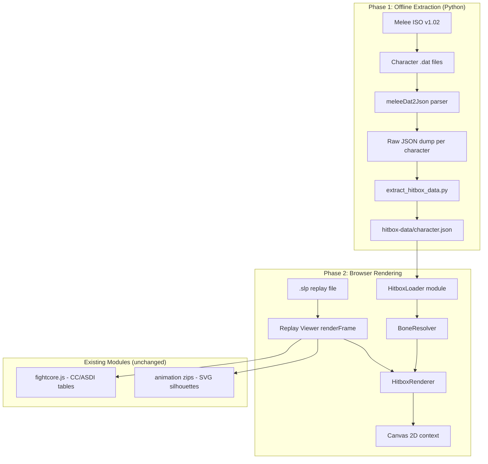
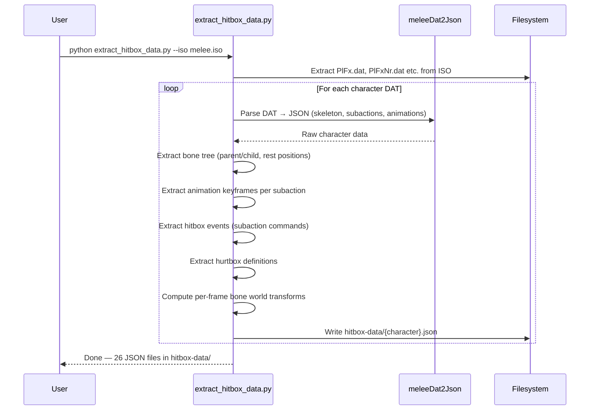
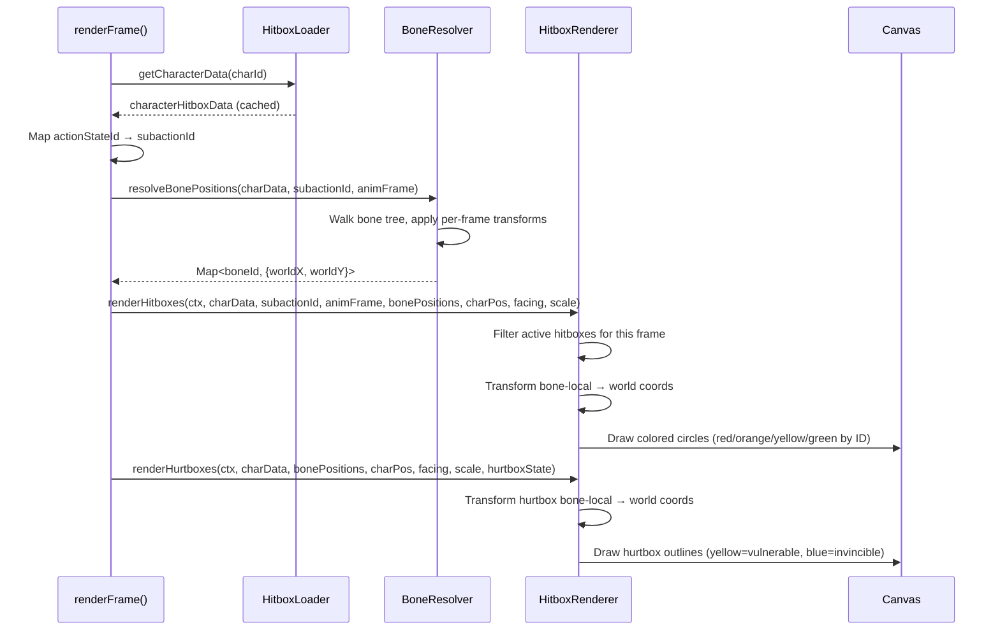

# Design Document: Accurate Hitbox/Hurtbox Rendering

## Overview

This feature replaces the current approximate hitbox visualization (FightCore text overlay + static bone position table) with an accurate, ISO-extracted hitbox/hurtbox rendering system. The system has two phases: an offline Python extraction pipeline that parses Melee character DAT files to produce per-character JSON data (hitboxes, hurtboxes, bone trees, and per-frame bone transforms), and a browser-side renderer that resolves bone-relative hitbox positions to world coordinates each frame and draws them as colored circles on the replay viewer canvas.

The current `fightcore.js` module already fetches hitbox geometry from `melee.theshoemaker.de` (pfirsich's meleeFrameDataExtractor output) and renders circles using a hardcoded `BONE_POSITIONS` lookup table. This produces inaccurate placement because bone positions change every animation frame. The new system replaces this with per-frame bone transforms extracted directly from the character DAT files, enabling frame-perfect hitbox positioning that matches what the game engine actually computes.

The extracted JSON files live in `hitbox-data/{character}.json`, are committed to the repo (the ISO is never committed), and are designed to work for both the current GitHub Pages site and the future Electron desktop app.

## Architecture



## Sequence Diagrams

### Extraction Pipeline



### Per-Frame Rendering



## Components and Interfaces

### Component 1: Extraction Script (`extract_hitbox_data.py`)

**Purpose**: Parse Melee character DAT files and produce compact JSON with all data needed for accurate hitbox rendering.

**Interface**:
```python
# CLI interface
# python extract_hitbox_data.py --iso path/to/melee.iso [--char fox] [--outdir hitbox-data]

class CharacterExtractor:
    def __init__(self, dat_json: dict, char_name: str):
        """Initialize from meleeDat2Json output for one character."""
        pass

    def extract_bone_tree(self) -> list[BoneNode]:
        """Extract skeleton hierarchy with rest-pose transforms."""
        pass

    def extract_animations(self) -> dict[int, Animation]:
        """Extract per-subaction animation keyframes (bone transforms per frame)."""
        pass

    def extract_hitboxes(self) -> dict[int, list[HitboxEvent]]:
        """Extract hitbox subaction commands per subaction ID."""
        pass

    def extract_hurtboxes(self) -> list[Hurtbox]:
        """Extract hurtbox definitions (bone, offset, size)."""
        pass

    def compute_bone_transforms(self, subaction_id: int, frame: int) -> dict[int, Transform2D]:
        """Compute world-space bone positions for a given subaction + frame."""
        pass

    def to_json(self) -> dict:
        """Serialize all extracted data to the output JSON schema."""
        pass
```

**Responsibilities**:
- Parse DAT files using meleeDat2Json as a library/subprocess
- Walk the JOBJ (joint object) tree to build the bone hierarchy
- Parse FIGATREE animation data to get per-frame bone transforms
- Parse subaction event lists to extract hitbox timing and properties
- Parse hurtbox structures from the fighter data
- Pre-compute bone world positions per animation frame to minimize browser-side math
- Output compact JSON (see Data Models section)

### Component 2: HitboxLoader (`hitbox-loader.js`)

**Purpose**: Load and cache per-character hitbox JSON data in the browser.

**Interface**:
```javascript
class HitboxLoader {
    constructor(basePath = 'hitbox-data') {}

    async load(charId) // → CharacterHitboxData | null
    // Fetches hitbox-data/{charName}.json, caches result.
    // Returns null if file not found (graceful degradation).

    get(charId) // → CharacterHitboxData | null
    // Synchronous cache lookup. Returns null if not yet loaded.

    preloadAll(charIds) // → Promise<void>
    // Parallel fetch for all characters in a replay.
}
```

**Responsibilities**:
- Map external character IDs (0-25) to JSON filenames
- Fetch and cache JSON data with error handling
- Provide synchronous access after initial load
- Support preloading at replay load time

### Component 3: BoneResolver (`bone-resolver.js`)

**Purpose**: Resolve bone-relative positions to world coordinates using pre-computed bone transforms.

**Interface**:
```javascript
const BoneResolver = {
    resolve(charData, subactionId, animFrame) // → Map<boneId, {x, y}>
    // Look up pre-computed bone world positions for this subaction + frame.
    // Falls back to rest-pose positions if animation data missing.

    transformPoint(bonePositions, boneId, offsetX, offsetY, offsetZ) // → {x, y}
    // Project a 3D bone-local offset to 2D world coordinates.
    // x = bone.x + offsetZ (forward axis)
    // y = bone.y + offsetY (vertical axis)
    // offsetX (lateral) is collapsed in 2D projection.
};
```

**Responsibilities**:
- Look up pre-computed bone positions from the JSON data
- Handle missing subaction/frame data with rest-pose fallback
- Project 3D bone-local hitbox offsets to 2D game coordinates
- Apply character scale factor

### Component 4: HitboxRenderer (`hitbox-renderer.js`)

**Purpose**: Draw hitboxes and hurtboxes on the replay viewer canvas.

**Interface**:
```javascript
const HitboxRenderer = {
    renderHitboxes(ctx, charData, subactionId, animFrame, bonePositions, 
                   charX, charY, facing, canvasScale, toCanvasX, toCanvasY)
    // Draw active hitbox circles for this frame.
    // Color-coded by hitbox ID: 0=red, 1=orange, 2=yellow, 3=green.

    renderHurtboxes(ctx, charData, bonePositions, charX, charY, facing, 
                    canvasScale, toCanvasX, toCanvasY, hurtboxState)
    // Draw hurtbox capsules/spheres.
    // Yellow outline = vulnerable, blue = invincible/intangible.

    getHitboxAtPoint(charData, subactionId, animFrame, bonePositions,
                     charX, charY, facing, gameX, gameY) // → HitboxInfo | null
    // Hit-test for hover tooltip. Returns hitbox properties if point is inside a hitbox.
};
```

**Responsibilities**:
- Filter hitbox events to find active hitboxes for the current frame
- Transform bone-local hitbox positions to canvas coordinates
- Draw circles with color-coding and transparency
- Draw hurtbox outlines (capsules approximated as pill shapes)
- Support hover hit-testing for tooltip display
- Respect independent hitbox/hurtbox toggle states

## Data Models

### Output JSON Schema: `hitbox-data/{character}.json`

```javascript
// Top-level character data file
{
  "character": "fox",           // Character name
  "internalId": 2,              // External character ID (matches .slp)
  "scale": 1.0,                 // Character model scale

  // Bone skeleton tree
  "bones": [
    {
      "id": 0,                  // Bone index
      "parent": -1,             // Parent bone index (-1 = root)
      "restX": 0.0,             // Rest-pose X position (game units)
      "restY": 0.0              // Rest-pose Y position (game units)
    }
    // ... ~30-60 bones per character
  ],

  // Subaction → hitbox/animation data
  // Keyed by subaction ID (integer as string for JSON)
  "subactions": {
    "44": {                     // Subaction ID (e.g., 44 = Attack11/jab1)
      "name": "Attack11",      // Action state name
      "totalFrames": 30,       // Total animation frames for this subaction

      // Per-frame bone world positions (pre-computed by extraction script)
      // Indexed by frame number. Only frames where bones move are stored (sparse).
      "boneFrames": {
        "0": {                  // Frame 0
          "0": [0.0, 0.0],     // Bone 0: [x, y] in character-local game units
          "3": [0.0, 5.2],     // Bone 3: torso
          "11": [4.1, 4.8]     // Bone 11: left hand
          // ... only bones referenced by hitboxes/hurtboxes are included
        },
        "5": { ... },          // Frame 5 (sparse — only keyframes stored)
        "10": { ... }
      },

      // Hitbox events (from subaction command list)
      "hitboxes": [
        {
          "id": 0,             // Hitbox ID (0-3, used for color-coding)
          "bone": 11,          // Bone attachment
          "x": 0.0,            // Offset from bone (lateral — collapsed in 2D)
          "y": 0.0,            // Offset from bone (vertical)
          "z": 2.5,            // Offset from bone (forward along bone axis)
          "size": 3.2,         // Hitbox radius (game units)
          "damage": 7,         // Damage percent
          "angle": 80,         // Launch angle (degrees, Sakurai=361)
          "kbg": 100,          // Knockback growth
          "bkb": 0,            // Base knockback
          "setKb": 0,          // Set knockback (0 = normal scaling)
          "element": 0,        // Element type (0=normal, 1=fire, etc.)
          "startFrame": 2,     // First active frame
          "endFrame": 5        // Last active frame (inclusive)
        }
        // ... multiple hitboxes per subaction
      ]
    }
    // ... one entry per subaction that has hitboxes
  },

  // Hurtbox definitions (constant across all animations — shape attached to bones)
  "hurtboxes": [
    {
      "bone": 3,               // Bone attachment
      "x": 0.0,               // Offset from bone
      "y": 0.0,
      "z": 0.0,
      "sizeX": 2.0,           // Half-extent X (capsule radius)
      "sizeY": 3.5,           // Half-extent Y (capsule half-length)
      "zone": "mid"           // "high" | "mid" | "low" (for zone-based interactions)
    }
    // ... ~15-20 hurtboxes per character
  ],

  // Action state ID → subaction ID mapping
  // Maps the .slp actionStateId to the DAT file's subaction index
  "actionStateMap": {
    "44": 44,                  // Most common actions: actionStateId == subactionId
    "45": 45,
    "341": 200,                // Character-specific specials: different mapping
    "342": 201
    // ... only entries where mapping differs or is character-specific
  }
}
```

**Validation Rules**:
- `bones[i].parent < i` for all non-root bones (tree ordering)
- `bones[0].parent === -1` (root bone)
- All `hitboxes[].bone` values reference valid bone IDs
- All `hurtboxes[].bone` values reference valid bone IDs
- `hitboxes[].startFrame <= hitboxes[].endFrame`
- `hitboxes[].startFrame < subaction.totalFrames`
- `hitboxes[].size > 0`
- `boneFrames` keys are valid frame numbers `[0, totalFrames)`

### File Size Estimation

Per character, estimated JSON sizes:
- Bones: ~30 bones × 20 bytes = ~600 bytes
- Subactions with hitboxes: ~40-80 per character
- Per subaction: ~5 hitboxes × 80 bytes + ~20 bone frames × 10 bones × 12 bytes = ~2.8 KB
- Hurtboxes: ~18 × 40 bytes = ~720 bytes
- Action state map: ~100 entries × 10 bytes = ~1 KB
- **Per character total: ~120-250 KB** (uncompressed JSON)
- **All 26 characters: ~3-6 MB** total
- With gzip (GitHub Pages serves gzipped): **~500 KB - 1.2 MB** over the wire

This is acceptable for a static site. Files can be lazy-loaded per character as replays are opened.

## Algorithmic Pseudocode

### Algorithm 1: Bone World Position Computation (Extraction Time)

```javascript
/**
 * Compute world-space 2D positions for all bones at a given animation frame.
 * This runs during extraction (Python) and results are stored in the JSON.
 * Shown in JS for consistency with the rendering code.
 */
function computeBoneWorldPositions(boneTree, animationData, frame) {
    // INPUT: boneTree = array of {id, parent, restTransform}
    //        animationData = per-bone keyframe tracks
    //        frame = animation frame number
    // OUTPUT: Map<boneId, {x, y}> world positions

    const worldTransforms = new Map();

    // Process bones in tree order (parent before child guaranteed by array ordering)
    for (const bone of boneTree) {
        // Get this bone's local transform for this frame
        // Interpolate between keyframes if frame falls between them
        const localTransform = interpolateKeyframes(
            animationData[bone.id], frame
        ) ?? bone.restTransform;

        // Compose with parent's world transform
        let worldTransform;
        if (bone.parent === -1) {
            worldTransform = localTransform;
        } else {
            const parentWorld = worldTransforms.get(bone.parent);
            worldTransform = multiplyTransforms(parentWorld, localTransform);
        }

        worldTransforms.set(bone.id, worldTransform);
    }

    // Project 3D transforms to 2D positions
    // Melee's coordinate system: X = lateral, Y = vertical, Z = forward/depth
    // For 2D rendering: gameX = Z component, gameY = Y component
    const positions = new Map();
    for (const [boneId, transform] of worldTransforms) {
        positions.set(boneId, {
            x: transform.translateZ,  // forward axis → 2D X
            y: transform.translateY   // vertical axis → 2D Y
        });
    }

    return positions;
}
```

**Preconditions:**
- `boneTree` is sorted in tree order (parent index < child index)
- `animationData` contains keyframe tracks for at least the root bone
- `frame >= 0`

**Postconditions:**
- Returns a position for every bone in `boneTree`
- Root bone position matches the animation's root motion
- Child positions are relative to character origin (not parent bone)

**Loop Invariant:**
- When processing bone `i`, all bones with index `< i` (including all ancestors) have their world transforms computed

### Algorithm 2: Hitbox World Position Resolution (Render Time)

```javascript
/**
 * Resolve a hitbox's bone-local offset to world game coordinates.
 * Runs per-frame in the browser during rendering.
 */
function resolveHitboxPosition(hitbox, bonePositions, charX, charY, facing, charScale) {
    // INPUT: hitbox = {bone, x, y, z, size} from JSON
    //        bonePositions = Map<boneId, {x, y}> for current frame
    //        charX, charY = character world position from .slp
    //        facing = 1 (right) or -1 (left)
    //        charScale = character scale factor
    // OUTPUT: {worldX, worldY, radius} in game coordinates

    // Step 1: Get bone position (pre-computed, already in character-local space)
    const bone = bonePositions.get(hitbox.bone) ?? { x: 0, y: 5 };

    // Step 2: Apply hitbox offset relative to bone
    // z = forward along bone axis → maps to X in 2D
    // y = vertical offset → maps to Y in 2D
    // x = lateral offset → collapsed (ignored in 2D side-view)
    const localX = (bone.x + hitbox.z) * charScale;
    const localY = (bone.y + hitbox.y) * charScale;

    // Step 3: Apply facing direction and character world position
    const worldX = charX + localX * facing;
    const worldY = charY + localY;

    // Step 4: Scale hitbox radius
    const radius = hitbox.size * charScale;

    return { worldX, worldY, radius };
}
```

**Preconditions:**
- `bonePositions` contains an entry for `hitbox.bone` (or falls back to default)
- `facing` is exactly `1` or `-1`
- `charScale > 0`

**Postconditions:**
- `worldX` and `worldY` are in Melee game-unit coordinates
- `radius > 0`
- Hitbox position reflects the character's facing direction

### Algorithm 3: Action State to Subaction Mapping

```javascript
/**
 * Map a .slp actionStateId to the DAT file's subaction index.
 * The .slp format uses "external" action state IDs.
 * The DAT file indexes subactions differently for character-specific moves.
 */
function mapActionToSubaction(charData, actionStateId) {
    // INPUT: charData = loaded character JSON
    //        actionStateId = from .slp post-frame data
    // OUTPUT: subactionId (integer) or null if no hitbox data exists

    // Step 1: Check explicit mapping table (handles character-specific offsets)
    if (charData.actionStateMap[String(actionStateId)] !== undefined) {
        const subId = charData.actionStateMap[String(actionStateId)];
        if (charData.subactions[String(subId)]) return subId;
    }

    // Step 2: For common actions (0-340), actionStateId === subactionId
    if (actionStateId < 341) {
        if (charData.subactions[String(actionStateId)]) return actionStateId;
    }

    // Step 3: No hitbox data for this action state
    return null;
}
```

**Preconditions:**
- `charData` is a valid loaded character JSON object
- `actionStateId >= 0`

**Postconditions:**
- Returns a valid subaction ID that exists in `charData.subactions`, or `null`
- For common actions (< 341), the mapping is identity unless overridden

### Algorithm 4: Per-Frame Bone Position Lookup with Interpolation

```javascript
/**
 * Look up bone positions for a specific animation frame.
 * The JSON stores sparse keyframes — interpolate between them.
 */
function getBonePositionsForFrame(subactionData, frame) {
    // INPUT: subactionData = subactions[subId] from character JSON
    //        frame = current animation frame (float, from actionStateCounter)
    // OUTPUT: Map<boneId, {x, y}>

    const boneFrames = subactionData.boneFrames;
    const frameKeys = Object.keys(boneFrames).map(Number).sort((a, b) => a - b);

    if (frameKeys.length === 0) return new Map();

    // Find surrounding keyframes
    const floorFrame = Math.floor(frame);
    let lo = 0, hi = frameKeys.length - 1;

    // Binary search for the keyframe at or before floorFrame
    while (lo < hi) {
        const mid = Math.ceil((lo + hi) / 2);
        if (frameKeys[mid] <= floorFrame) lo = mid;
        else hi = mid - 1;
    }

    const kfA = frameKeys[lo];
    const kfB = (lo + 1 < frameKeys.length) ? frameKeys[lo + 1] : kfA;

    // Interpolation factor
    const t = (kfA === kfB) ? 0 : (frame - kfA) / (kfB - kfA);

    const posA = boneFrames[String(kfA)];
    const posB = boneFrames[String(kfB)];

    const result = new Map();
    const allBones = new Set([...Object.keys(posA), ...Object.keys(posB)]);

    for (const boneIdStr of allBones) {
        const a = posA[boneIdStr] ?? posB[boneIdStr];
        const b = posB[boneIdStr] ?? posA[boneIdStr];
        result.set(Number(boneIdStr), {
            x: a[0] + (b[0] - a[0]) * t,
            y: a[1] + (b[1] - a[1]) * t
        });
    }

    return result;
}
```

**Preconditions:**
- `subactionData.boneFrames` is a non-empty object with numeric string keys
- `frame >= 0`

**Postconditions:**
- Returns positions for all bones that appear in any keyframe
- Positions are linearly interpolated between surrounding keyframes
- If frame is before first keyframe, uses first keyframe positions
- If frame is after last keyframe, uses last keyframe positions

**Loop Invariant:**
- Binary search maintains `frameKeys[lo] <= floorFrame < frameKeys[hi+1]`

## Key Functions with Formal Specifications

### Function: `HitboxLoader.load(charId)`

```javascript
async load(charId) // → CharacterHitboxData | null
```

**Preconditions:**
- `charId` is an integer in `[0, 25]`
- Network access is available (or file is cached)

**Postconditions:**
- Returns parsed JSON data conforming to the character schema, or `null` on failure
- Result is cached — subsequent calls return the same object reference
- Does not throw — errors are caught and logged

### Function: `BoneResolver.resolve(charData, subactionId, animFrame)`

```javascript
resolve(charData, subactionId, animFrame) // → Map<boneId, {x, y}>
```

**Preconditions:**
- `charData` is a valid character JSON object
- `subactionId` exists in `charData.subactions` (or function returns rest-pose fallback)
- `animFrame >= 0`

**Postconditions:**
- Returns a Map with entries for all bones referenced by hitboxes/hurtboxes
- Positions are in character-local game units (origin at character feet)
- Falls back to `charData.bones[i].restX/restY` if subaction has no bone frame data

### Function: `HitboxRenderer.renderHitboxes(...)`

```javascript
renderHitboxes(ctx, charData, subactionId, animFrame, bonePositions,
               charX, charY, facing, canvasScale, toCanvasX, toCanvasY)
```

**Preconditions:**
- `ctx` is a valid CanvasRenderingContext2D
- `bonePositions` is the output of `BoneResolver.resolve()`
- `toCanvasX/toCanvasY` are the coordinate transform functions from `renderFrame()`

**Postconditions:**
- Only hitboxes where `startFrame <= animFrame <= endFrame` are drawn
- Each hitbox is drawn as a filled+stroked circle at the correct world position
- Color is determined by hitbox ID: 0=red, 1=orange, 2=yellow, 3=green
- Damage value is rendered inside hitboxes large enough to contain text
- Canvas state is restored (save/restore around all drawing)

## Example Usage

### Extraction (Python CLI)

```python
# Extract all characters
python extract_hitbox_data.py --iso ~/melee.iso --outdir hitbox-data/

# Extract single character for testing
python extract_hitbox_data.py --iso ~/melee.iso --char fox --outdir hitbox-data/

# Validate output
python extract_hitbox_data.py --validate hitbox-data/fox.json
```

### Browser Integration (in renderFrame)

```javascript
// At replay load time — preload hitbox data for characters in this replay
const hitboxLoader = new HitboxLoader('hitbox-data');
await hitboxLoader.preloadAll(players.map(p => p.characterId));

// Inside renderFrame(), per player:
const charData = hitboxLoader.get(charId);
if (charData && hitboxMode) {
    const subactionId = mapActionToSubaction(charData, actionStateId);
    if (subactionId !== null) {
        const animFrame = Math.floor(actionStateCounter);
        const subaction = charData.subactions[String(subactionId)];
        const bonePositions = getBonePositionsForFrame(subaction, actionStateCounter);

        // Draw hitboxes
        HitboxRenderer.renderHitboxes(
            ctx, charData, subactionId, animFrame, bonePositions,
            gameX, gameY, renderFacing, scale, toCanvasX, toCanvasY
        );

        // Draw hurtboxes
        HitboxRenderer.renderHurtboxes(
            ctx, charData, bonePositions,
            gameX, gameY, renderFacing, scale, toCanvasX, toCanvasY,
            hurtboxState
        );
    }
}

// Hover tooltip
canvas.addEventListener('mousemove', (e) => {
    if (!hitboxMode) return;
    const gameX = toGameX(e.offsetX * dpr);
    const gameY = toGameY(e.offsetY * dpr);
    // Check each player's hitboxes
    for (const player of players) {
        const info = HitboxRenderer.getHitboxAtPoint(
            charData, subactionId, animFrame, bonePositions,
            playerX, playerY, facing, gameX, gameY
        );
        if (info) {
            showHitboxTooltip(e.clientX, e.clientY, info);
            return;
        }
    }
    hideHitboxTooltip();
});
```

## Correctness Properties

*A property is a characteristic or behavior that should hold true across all valid executions of a system — essentially, a formal statement about what the system should do. Properties serve as the bridge between human-readable specifications and machine-verifiable correctness guarantees.*

### Property 1: Bone tree ordering invariant

*For any* valid Character_JSON, every non-root bone in the Bone_Tree has a parent index strictly less than its own index, guaranteeing that processing bones in array order visits all ancestors before descendants.

**Validates: Requirement 2.1**

### Property 2: Bone reference integrity

*For any* valid Character_JSON, every bone ID referenced by a Hitbox_Event or Hurtbox exists in the character's Bone_Tree.

**Validates: Requirements 2.3, 2.4**

### Property 3: Character JSON data invariants

*For any* valid Character_JSON: every Hitbox_Event has `startFrame <= endFrame`, every Hitbox_Event has `startFrame < totalFrames` for its containing subaction, every Hitbox_Event has `size > 0`, and all Bone_Frame_Data keys are valid frame numbers within `[0, totalFrames)`.

**Validates: Requirements 2.5, 2.6, 2.7, 2.8**

### Property 4: Loader caching idempotence

*For any* character ID, calling `HitboxLoader.load()` twice returns the same object reference on the second call without issuing a second network request.

**Validates: Requirement 4.2**

### Property 5: Keyframe interpolation bounds

*For any* two adjacent sparse keyframes A and B with bone positions, and any interpolation parameter t ∈ [0, 1], the interpolated bone position at t is bounded component-wise by min(A, B) and max(A, B).

**Validates: Requirement 5.2**

### Property 6: Rest pose fallback

*For any* subaction with empty or missing Bone_Frame_Data, the BoneResolver returns the Rest_Pose positions from the Bone_Tree for all bones.

**Validates: Requirements 5.3, 10.3**

### Property 7: 3D to 2D coordinate projection

*For any* 3D bone-local offset (x, y, z) and bone world position (bx, by), the projected 2D position is `(bx + z, by + y)` — the Z axis maps to game X, the Y axis maps to game Y, and the lateral X axis is collapsed.

**Validates: Requirement 5.4**

### Property 8: Action state mapping correctness

*For any* character data and action state ID: if an explicit mapping exists in the Action_State_Map, that mapping is used; if no explicit mapping exists and the ID is less than 341, the ID is used directly as the subaction ID; otherwise null is returned.

**Validates: Requirements 6.1, 6.2, 6.3**

### Property 9: Hitbox active frame filtering

*For any* hitbox with active frame range [startFrame, endFrame] and any animation frame f, the hitbox is rendered if and only if `startFrame <= f <= endFrame`.

**Validates: Requirement 7.1**

### Property 10: Hitbox and hurtbox world position computation

*For any* hitbox or hurtbox with bone attachment, bone-local offset, character position, facing direction, and scale factor, the world position is computed as: `worldX = charX + (bone.x + offset.z) * scale * facing`, `worldY = charY + (bone.y + offset.y) * scale`, and `radius = size * scale`.

**Validates: Requirements 7.3, 7.4, 7.5, 8.1, 8.4**

### Property 11: Hit-test point-in-circle correctness

*For any* active hitbox circle at world position (cx, cy) with radius r, and any test point (px, py): `getHitboxAtPoint` returns the hitbox info if and only if `(px - cx)² + (py - cy)² <= r²`.

**Validates: Requirements 9.1, 9.2**

## Error Handling

### Error Scenario 1: Missing Hitbox JSON

**Condition**: `hitbox-data/{character}.json` not found (404) or fails to parse
**Response**: `HitboxLoader.load()` returns `null`, logs a warning
**Recovery**: Renderer falls back to existing FightCore approximation (current behavior). User sees approximate hitboxes rather than nothing.

### Error Scenario 2: Unknown Action State

**Condition**: `.slp` reports an `actionStateId` not present in `charData.actionStateMap` or `charData.subactions`
**Response**: `mapActionToSubaction()` returns `null`
**Recovery**: No hitboxes drawn for that frame. This is correct — many action states (Wait, Walk, etc.) have no hitboxes.

### Error Scenario 3: Missing Bone Frame Data

**Condition**: A subaction's `boneFrames` is empty or missing frames for the current animation frame
**Response**: `getBonePositionsForFrame()` returns rest-pose positions from `charData.bones`
**Recovery**: Hitboxes render at approximate rest-pose positions. Less accurate but still useful.

### Error Scenario 4: Corrupt DAT File During Extraction

**Condition**: meleeDat2Json fails to parse a character's DAT file
**Response**: Extraction script logs error, skips that character, continues with remaining characters
**Recovery**: Missing character's JSON file means browser falls back to FightCore approximation for that character.

### Error Scenario 5: ISO Version Mismatch

**Condition**: User provides a non-v1.02 NTSC ISO
**Response**: Extraction script detects version from ISO header, warns if not v1.02
**Recovery**: Script attempts extraction anyway (structure is similar across versions) but warns that hitbox data may be inaccurate.

## Testing Strategy

### Unit Testing Approach

- **Bone tree traversal**: Verify that a known 3-bone chain (root → torso → hand) produces correct world positions given known local transforms
- **Hitbox active frame filtering**: Verify that hitboxes are only returned when `startFrame <= frame <= endFrame`
- **Action state mapping**: Verify known mappings (e.g., actionStateId 44 → Attack11 → jab1) for all 26 characters
- **Coordinate projection**: Verify that 3D bone-local offsets project correctly to 2D (Z→X, Y→Y, X collapsed)
- **Facing direction**: Verify hitbox X coordinates flip correctly when facing = -1
- **JSON schema validation**: Verify all 26 character JSON files conform to the schema

### Property-Based Testing Approach

**Property Test Library**: fast-check (already available in the project's JS ecosystem)

- **Bone tree ordering**: For any valid bone tree, processing in array order guarantees all parents are processed before children
- **Interpolation bounds**: For any two keyframes A and B, interpolated positions at t ∈ [0,1] are bounded by min(A,B) and max(A,B) per component
- **Hitbox radius positivity**: For any hitbox in any character's data, `size * charScale > 0`
- **Round-trip consistency**: Extracting from DAT → JSON → loading in browser produces the same bone positions as direct computation

### Integration Testing Approach

- **Visual regression**: Load known replays (Fox vs Marth on FD) and screenshot hitbox rendering at specific frames. Compare against reference images from Rwing or 20XX debug mode.
- **FightCore comparison**: For moves where FightCore has hitbox data, verify that the new system's hitbox positions are within 2 game units of the FightCore approximation (sanity check, not exact match since FightCore uses static bone positions).
- **Full replay playback**: Play through a complete replay with hitbox rendering enabled, verify no crashes or visual glitches.

## Performance Considerations

- **JSON loading**: Lazy-load per character on first replay open. ~120-250 KB per character (gzipped ~30-60 KB). Cached in memory after first load.
- **Per-frame computation**: Bone position lookup is O(B) where B = number of bones (~30-60). Hitbox filtering is O(H) where H = hitboxes per subaction (~5-10). Both are negligible compared to canvas drawing.
- **Sparse keyframes**: Storing only keyframes (not every frame) reduces JSON size by ~60-80%. Linear interpolation at render time is cheap (one lerp per bone per frame).
- **Memory**: All 26 characters loaded simultaneously would use ~3-6 MB of parsed JSON. Acceptable for modern browsers.
- **Canvas drawing**: Each hitbox is one `arc()` + `fill()` + `stroke()` call. With ~5 active hitboxes per player, this adds ~10-20 draw calls per frame — negligible.

## Security Considerations

- **ISO never leaves the user's machine**: The extraction script runs locally. The ISO path is a CLI argument, never transmitted anywhere.
- **No ISO data in JSON**: The output JSON contains only numeric hitbox/bone data. No copyrighted assets (textures, models, audio) are extracted.
- **JSON files are static**: Served from GitHub Pages as static files. No server-side processing, no user input handling.
- **Fetch validation**: `HitboxLoader` validates that fetched JSON has expected structure before using it. Malformed JSON is rejected gracefully.

## Dependencies

### Extraction (Phase 1)
- **Python 3.8+**: Script runtime
- **pfirsich/meleeDat2Json**: DAT file parser (Python library, MIT license)
- **pfirsich/meleeFrameDataExtractor**: Reference for subaction command parsing (Python, MIT license)
- **Melee ISO v1.02 NTSC**: User-provided, never committed to repo

### Rendering (Phase 2)
- **No new dependencies**: Pure vanilla JS, integrates into existing `player-notes.html`
- **Existing**: Canvas 2D API, `fightcore.js` (kept for CC/ASDI tables, FightCore text overlay becomes optional fallback)

### Reference Resources
- **doldecomp/melee**: Melee decompilation — documents JOBJ, FIGATREE, subaction command structures
- **BroccoliRaab/meleedb**: Pre-built hitbox database — useful for validation/cross-referencing

### Future Integration: Inline Move Linking

The extracted hitbox JSON data is also consumed by the planned `move-linker.js` module (see modular matchup pages spec). When move names appear as text in matchup page sections or player notes, they become clickable links that show a popup with:
- Mini hitbox visualization rendered from `hitbox-data/{character}.json` (the same data this spec produces)
- Frame data from `fightcore.js` (startup, active, total, IASA, landing lag)
- Damage, angle, KBG, BKB per hitbox
- CC/ASDI Down max percents for the matchup context

This means the hitbox JSON schema must support efficient single-move lookups (already satisfied — subactions are keyed by ID). The `HitboxRenderer` should expose a `renderSingleMove(ctx, charData, subactionId, frame, width, height)` function for rendering a move's hitboxes into a small popup canvas.
- **HSDLib**: .NET HAL DAT parser — reference for understanding the binary format
- **melee.theshoemaker.de**: Existing extractor output — starting point / validation baseline
