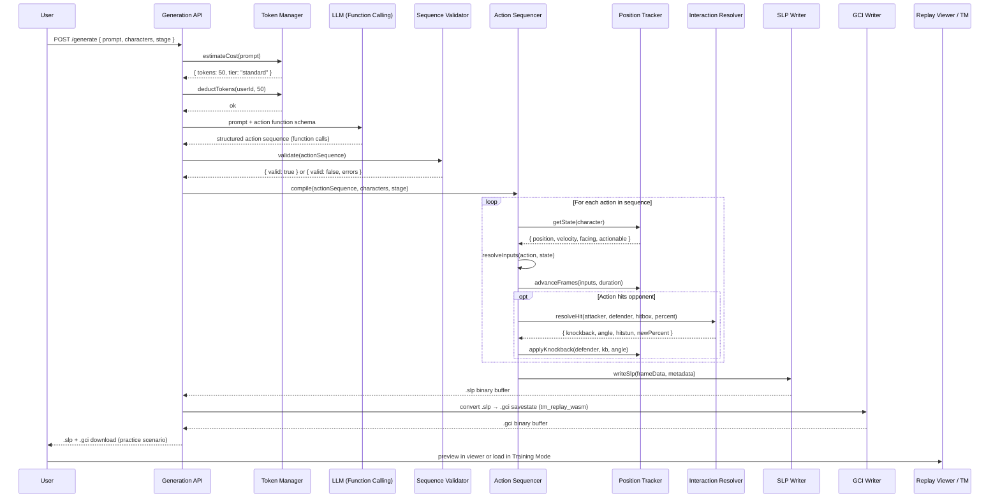
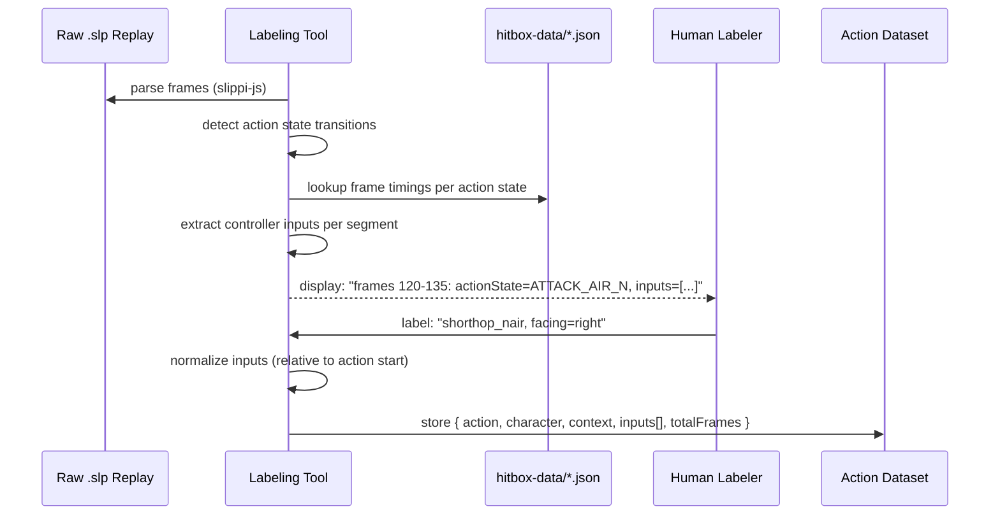

# Design Document: AI Replay Generation (Prompt → Practice Scenarios)

## Overview

This feature is a standalone AI-powered practice scenario generator for Super Smash Bros. Melee. Users describe a situation they want to practice in natural language (e.g., "Fox dash dances then nairs me at 40% on Battlefield") and the system generates frame-perfect playable files: both a `.slp` replay for visualization and an UnclePunch Training Mode `.gci` savestate for hands-on practice on console/Dolphin.

The primary use case is **training**: a player describes what they want to drill, and the tool generates a savestate they can load in Training Mode to practice reacting to or punishing that exact scenario. This is fundamentally different from generic replay generation — every output is designed to be a practice rep.

The system is built in three layers: (1) a manually curated **Action Dataset** mapping human-readable action names to exact frame-level controller input sequences spanning one or more game states per character, (2) a **Replay Compiler** that chains these actions into valid `.slp` binary files while tracking positions, velocities, and interactions, and (3) an **LLM Prompt Layer** that translates natural language into structured action sequences using function calling against the action library schema. A token-based monetization layer wraps the generation API.

This tool can operate independently of the Melee replay viewer website, but leverages the existing project infrastructure as critical building blocks: `hitbox-data/*.json` contains per-character frame timing data (startup, active frames, endlag) with bone positions and hitbox events; the IKneeData calculator implements Melee's knockback formula; `slippi-js` provides `.slp` parsing that can be reversed for writing; FightCore data supplies damage/angle/knockback values per move; and `@gcpreston/tm_replay_wasm` already converts `.slp` data to UnclePunch `.gci` savestates.

## Architecture

```mermaid
graph TB
    subgraph "User Interface"
        NL[Natural Language Input<br/>"Fox nairs me at 40%<br/>on Battlefield"]
        RV[Replay Viewer<br/>player-notes.html]
        TM_APP[Training Mode<br/>UnclePunch / Dolphin]
        FB[Feedback Loop<br/>"make dash dance wider"]
    end

    subgraph "LLM Prompt Layer"
        LLM[LLM API<br/>Function Calling]
        VAL[Sequence Validator]
        SCHEMA[Action Function Schema<br/>generated from Action Dataset]
    end

    subgraph "Replay Compiler"
        SEQ[Action Sequencer]
        POS[Position/Velocity Tracker]
        INT[Interaction Resolver<br/>IKneeData knockback math]
        SLP[SLP Binary Writer]
        GCI[GCI Savestate Writer<br/>@gcpreston/tm_replay_wasm]
    end

    subgraph "Action Dataset"
        AD[(action-dataset/*.json<br/>per-character action→input maps)]
        LT[Labeling Tool<br/>semi-automated .slp analyzer]
        HD[(hitbox-data/*.json<br/>frame timings, hitboxes)]
        FC[(FightCore Data<br/>damage, angles, knockback)]
    end

    subgraph "Monetization"
        TOK[Token Manager]
        EST[Complexity Estimator]
        API[Generation API<br/>Netlify Function]
    end

    NL --> API
    API --> TOK
    TOK --> LLM
    LLM --> SCHEMA
    LLM --> VAL
    VAL --> SEQ
    SEQ --> POS
    SEQ --> INT
    INT --> SLP
    SLP --> GCI
    SLP --> RV
    GCI --> TM_APP
    RV --> FB
    FB --> LLM

    LT --> AD
    HD --> LT
    HD --> INT
    FC --> INT
    AD --> SCHEMA
    AD --> SEQ

    EST --> TOK

    style LLM fill:#2d5a27
    style SEQ fill:#2d5a27
    style SLP fill:#2d5a27
    style AD fill:#1a3a5c
    style LT fill:#1a3a5c
```

## Sequence Diagrams

### Main Flow: Natural Language → Playable Replay



### Dataset Labeling Flow



## Components and Interfaces

### action-dataset.js — ActionDataset

Loads and queries the per-character action→input dataset. Provides the function schema for LLM integration.

```javascript
export default class ActionDataset {
    constructor(basePath = 'action-dataset') {}

    /**
     * Load action dataset for a character.
     * @param {string} character - Character name (e.g., "fox", "marth")
     * @returns {Promise<CharacterActions|null>}
     */
    async load(character) {}

    /**
     * Get the input sequence for a specific action in a given context.
     * @param {string} character
     * @param {string} actionName - e.g., "shorthop_nair", "wavedash_forward"
     * @param {ActionContext} context - Current state context
     * @returns {ActionInputSequence|null}
     */
    getAction(character, actionName, context) {}

    /**
     * List all available actions for a character.
     * @param {string} character
     * @returns {string[]} Action names
     */
    listActions(character) {}

    /**
     * Generate the LLM function-calling schema from the loaded dataset.
     * Each action becomes a callable function with typed parameters.
     * @param {string[]} characters - Characters in the scenario
     * @returns {FunctionSchema[]}
     */
    generateFunctionSchema(characters) {}

    /**
     * Get frame timing data for an action (startup, active, endlag, IASA).
     * Merges hitbox-data timing with dataset timing.
     * @param {string} character
     * @param {string} actionName
     * @returns {FrameTiming}
     */
    getFrameTiming(character, actionName) {}
}
```

**Responsibilities:**
- Load/cache per-character action JSON files
- Resolve context-dependent input variants (grounded vs airborne, facing direction)
- Generate LLM function schemas from the action library
- Merge frame timing data from hitbox-data and FightCore sources

### replay-compiler.js — ReplayCompiler

The core engine that transforms a sequence of high-level actions into frame-by-frame game state and controller inputs.

```javascript
export default class ReplayCompiler {
    /**
     * @param {ActionDataset} dataset
     * @param {object} options - { stage, characters: [{id, character, port, startPercent}] }
     */
    constructor(dataset, options) {}

    /**
     * Compile a validated action sequence into frame data.
     * @param {CompiledAction[]} actions - Ordered action sequence from LLM
     * @returns {CompilationResult}
     */
    compile(actions) {}

    /**
     * Get the current state of a character (position, velocity, actionable frame).
     * @param {number} playerIndex
     * @returns {CharacterState}
     */
    getCharacterState(playerIndex) {}

    /**
     * Advance the simulation by one frame, applying controller inputs.
     * @param {FrameInputs} inputs - Per-player controller inputs for this frame
     * @returns {FrameState}
     */
    advanceFrame(inputs) {}

    /**
     * Resolve a hit interaction between attacker and defender.
     * Uses IKneeData knockback formula.
     * @param {number} attackerIdx
     * @param {number} defenderIdx
     * @param {HitboxData} hitbox
     * @returns {HitResult}
     */
    resolveHit(attackerIdx, defenderIdx, hitbox) {}
}
```

**Responsibilities:**
- Chain atomic actions respecting frame timings and IASA windows
- Track per-character position, velocity, facing direction, percent
- Resolve hit interactions using Melee knockback formula
- Produce frame-by-frame controller input + game state arrays

### slp-writer.js — SlpWriter

Generates valid `.slp` binary files from compiled frame data, and optionally converts to UnclePunch Training Mode `.gci` savestates via `@gcpreston/tm_replay_wasm`. The `.gci` output is the primary deliverable for practice — users load it in Training Mode Community Edition on console or Dolphin to drill the exact scenario they described.

References the Slippi file format spec and `slippi-js` for structure.

```javascript
export default class SlpWriter {
    /**
     * Write a complete .slp file from compiled frame data.
     * @param {CompilationResult} compilation
     * @param {SlpMetadata} metadata - { stage, characters, date, duration }
     * @returns {Uint8Array} .slp binary data
     */
    static write(compilation, metadata) {}

    /**
     * Write the UBJSON game start payload.
     * @param {SlpMetadata} metadata
     * @returns {Uint8Array}
     */
    static writeGameStart(metadata) {}

    /**
     * Write a single pre-frame update (controller inputs).
     * @param {number} frameIndex
     * @param {number} playerIndex
     * @param {ControllerInput} input
     * @returns {Uint8Array}
     */
    static writePreFrame(frameIndex, playerIndex, input) {}

    /**
     * Write a single post-frame update (game state).
     * @param {number} frameIndex
     * @param {number} playerIndex
     * @param {PostFrameState} state
     * @returns {Uint8Array}
     */
    static writePostFrame(frameIndex, playerIndex, state) {}

    /**
     * Write the game end payload.
     * @param {number} endMethod - 0=unresolved, 1=time, 2=game, 3=resolved, 7=no contest
     * @returns {Uint8Array}
     */
    static writeGameEnd(endMethod) {}

    /**
     * Convert a .slp binary to an UnclePunch Training Mode .gci savestate.
     * Uses @gcpreston/tm_replay_wasm (same module already used in the replay viewer).
     * The .gci is a 300-frame savestate loadable in Training Mode Community Edition.
     * @param {Uint8Array} slpData - Complete .slp binary
     * @param {number} targetFrame - Frame to center the savestate around
     * @param {number} playerIndex - Which player the user controls
     * @returns {Promise<Uint8Array>} .gci binary data
     */
    static async writeGci(slpData, targetFrame, playerIndex) {}
}
```

**Responsibilities:**
- Produce valid `.slp` binary format (UBJSON event stream)
- Write game start, pre-frame, post-frame, and game end events
- Handle Slippi version compatibility (target v3.x format)
- Ensure output is loadable by Slippi Desktop, slippilab, and our viewer
- Convert `.slp` to `.gci` savestate via `tm_replay_wasm` for Training Mode practice
- The `.gci` is the primary practice deliverable — a 300-frame savestate the user loads on console/Dolphin

### sequence-validator.js — SequenceValidator

Validates that an LLM-generated action sequence is physically possible in Melee.

```javascript
export default class SequenceValidator {
    /**
     * @param {ActionDataset} dataset
     */
    constructor(dataset) {}

    /**
     * Validate an action sequence for physical possibility.
     * @param {CompiledAction[]} actions
     * @param {string[]} characters
     * @returns {ValidationResult}
     */
    validate(actions, characters) {}

    /**
     * Check if an action can start from the current state.
     * @param {string} character
     * @param {string} actionName
     * @param {CharacterState} state
     * @returns {{ valid: boolean, reason?: string }}
     */
    canPerformAction(character, actionName, state) {}

    /**
     * Check frame gap between consecutive actions for timing validity.
     * @param {CompiledAction} prev
     * @param {CompiledAction} next
     * @param {CharacterState} state
     * @returns {{ valid: boolean, gapFrames: number, reason?: string }}
     */
    checkTransition(prev, next, state) {}
}
```

**Responsibilities:**
- Reject impossible sequences (action during hitstun, aerial while grounded, etc.)
- Verify frame timing gaps between consecutive actions
- Check state prerequisites (must be airborne for aerial, must be shielding for OOS options)
- Return actionable error messages for LLM retry

### labeling-tool.js — LabelingTool

Semi-automated tool for building the action dataset from existing `.slp` replays.

```javascript
export default class LabelingTool {
    /**
     * @param {ActionDataset} dataset - Target dataset to write to
     */
    constructor(dataset) {}

    /**
     * Parse a .slp replay and detect action state segments.
     * @param {Uint8Array} slpData - Raw .slp file data
     * @returns {ActionSegment[]} Detected segments with inputs
     */
    detectSegments(slpData) {}

    /**
     * Extract controller inputs for a frame range from parsed replay.
     * @param {object} parsedReplay - slippi-js parsed game
     * @param {number} playerIndex
     * @param {number} startFrame
     * @param {number} endFrame
     * @returns {ControllerInput[]}
     */
    extractInputs(parsedReplay, playerIndex, startFrame, endFrame) {}

    /**
     * Apply a human label to a detected segment.
     * @param {ActionSegment} segment
     * @param {string} actionName - Human-readable action name
     * @param {ActionContext} context - State context for this action
     * @returns {ActionEntry} Normalized dataset entry
     */
    labelSegment(segment, actionName, context) {}

    /**
     * Auto-detect common actions from action state IDs.
     * Maps known actionStateIds to probable action names.
     * @param {ActionSegment} segment
     * @returns {{ suggestedName: string, confidence: number }|null}
     */
    autoLabel(segment) {}
}
```

**Responsibilities:**
- Parse `.slp` replays via `slippi-js` and detect action state transitions
- Extract raw controller inputs per frame for each segment
- Suggest labels based on action state ID mapping (semi-automation)
- Normalize inputs relative to action start frame and facing direction

### token-manager.js — TokenManager

Handles token-based monetization: cost estimation, balance tracking, and deduction.

```javascript
export default class TokenManager {
    /**
     * Estimate token cost for a generation request.
     * @param {GenerationRequest} request
     * @returns {CostEstimate}
     */
    static estimateCost(request) {}

    /**
     * Check if a user has sufficient tokens.
     * @param {string} userId
     * @param {number} requiredTokens
     * @returns {Promise<boolean>}
     */
    async checkBalance(userId, requiredTokens) {}

    /**
     * Deduct tokens from a user's balance.
     * @param {string} userId
     * @param {number} tokens
     * @param {string} reason - Description of the generation
     * @returns {Promise<TransactionResult>}
     */
    async deductTokens(userId, tokens, reason) {}

    /**
     * Get pricing tier for a request.
     * @param {GenerationRequest} request
     * @returns {PricingTier}
     */
    static getPricingTier(request) {}
}
```

**Responsibilities:**
- Estimate cost based on action count, character count, duration, interaction complexity
- Manage user token balances (stored server-side)
- Enforce free tier limits (single-action demos)
- Log transactions for billing

## Data Models

### What Is an "Action"?

A Melee action is **not** a single game state — it is a named, intentional technique that spans one or more action states and requires specific controller inputs timed precisely across those states.

For example:
- **`wavedash_forward`**: spans `KneeBend` (3 frames) + `LandingFallSpecial` (~11 frames). The jump button is pressed on frame 0, the airdodge angle (stick forward-diagonal + L/R trigger) is input on frame 2-3 of the jumpsquat. The state machine transitions are a *consequence* of the inputs, not the definition of the action.
- **`shorthop_nair`**: spans `KneeBend` + `JumpF` + `AttackAirN` + `LandingAirN`. The jump button is tapped (not held) for a shorthop, A is pressed during the jump, L is pressed before landing for L-cancel.
- **`dash_dance`**: spans repeated `Dash` states in alternating directions. The action is defined by the timing of stick reversals within the initial dash window.
- **`shine_oos`** (shine out of shield): spans `Guard` + `SpecialLwStart`. The down-B input must happen within 1 frame of shield release.

**Key insight**: The action state sequence is a *fingerprint* that helps identify what happened, but the actual definition of the action is the **input sequence** — the stick positions, buttons, and trigger values on specific frames relative to the action start. Two players can produce the same state sequence with different inputs (e.g., wavedash forward vs wavedash back both go through `KneeBend → LandingFallSpecial`), and the inputs are what distinguish them.

**Action names are universal, input sequences are character-specific.** `wavedash_forward` means the same thing for every character — jump and airdodge forward at a shallow angle. But the exact input timing differs per character because jumpsquat length varies (Fox: 3 frames, Marth: 4 frames, Luigi: 5 frames, etc.). This is why each character has their own `action-dataset/{character}.json` file with their own input sequences for the same named actions. When the LLM calls `wavedash_forward(player=0, character="fox")`, the compiler looks up Fox's specific input sequence — not a generic one.

The dataset stores:
1. The **input sequence** (what the player actually pressed, frame by frame)
2. The **state sequence** (which action states were traversed — useful for validation)
3. The **context** (grounded/airborne, facing direction, what state the character was in before)
4. The **timing** (startup, active frames, endlag — derived from frame data, not from inputs)

### Action Dataset Schema: `action-dataset/{character}.json`

```javascript
{
  "character": "fox",
  "actions": {
    "shorthop_nair": {
      "category": "aerial",
      "description": "Short hop neutral aerial",
      "variants": [
        {
          "context": {
            "grounded": true,
            "facing": "right",
            "fromState": "idle"    // or "dash", "shield", "ledge", etc.
          },
          "inputs": [
            { "frame": 0, "stick": { "x": 0.0, "y": 1.0 }, "buttons": [], "trigger": 0.0 },
            { "frame": 1, "stick": { "x": 0.0, "y": 0.0 }, "buttons": [], "trigger": 0.0 },
            { "frame": 3, "stick": { "x": 0.0, "y": 0.0 }, "buttons": ["A"], "trigger": 0.0 },
            { "frame": 7, "stick": { "x": 0.0, "y": 0.0 }, "buttons": [], "trigger": 0.0 }
          ],
          "totalFrames": 32,
          "lCancelFrame": 29,
          "actionStateId": 58,
          "notes": "Y tap on frame 0 for shorthop, A on frame 3 for earliest nair"
        },
        {
          "context": {
            "grounded": true,
            "facing": "left",
            "fromState": "idle"
          },
          "inputs": [
            { "frame": 0, "stick": { "x": 0.0, "y": 1.0 }, "buttons": [], "trigger": 0.0 },
            { "frame": 1, "stick": { "x": 0.0, "y": 0.0 }, "buttons": [], "trigger": 0.0 },
            { "frame": 3, "stick": { "x": 0.0, "y": 0.0 }, "buttons": ["A"], "trigger": 0.0 },
            { "frame": 7, "stick": { "x": 0.0, "y": 0.0 }, "buttons": [], "trigger": 0.0 }
          ],
          "totalFrames": 32,
          "lCancelFrame": 29,
          "actionStateId": 58,
          "notes": "Same as right-facing, nair is symmetric"
        }
      ],
      "timing": {
        "startup": 4,
        "activeFrames": [4, 7],
        "endlag": 15,
        "iasa": 28,
        "landingLag": 15,
        "lCancelLag": 7,
        "autocancel": [1, 3, 28, 32]
      }
    },
    "wavedash_forward": {
      "category": "movement",
      "description": "Wavedash forward (max distance)",
      "variants": [
        {
          "context": {
            "grounded": true,
            "facing": "right",
            "fromState": "idle"
          },
          "inputs": [
            { "frame": 0, "stick": { "x": 0.0, "y": 1.0 }, "buttons": ["X"], "trigger": 0.0 },
            { "frame": 1, "stick": { "x": 0.0, "y": 0.0 }, "buttons": [], "trigger": 0.0 },
            { "frame": 2, "stick": { "x": 0.8, "y": -0.4 }, "buttons": ["L"], "trigger": 1.0 },
            { "frame": 3, "stick": { "x": 0.0, "y": 0.0 }, "buttons": [], "trigger": 0.0 }
          ],
          "totalFrames": 14,
          "actionStateId": 44,
          "notes": "Jump frame 0, airdodge frame 2 at ~17° angle for max distance"
        }
      ],
      "timing": {
        "startup": 1,
        "activeFrames": null,
        "endlag": 10,
        "iasa": 14,
        "landingLag": 10,
        "lCancelLag": null,
        "autocancel": null
      }
    },
    "dash_dance": {
      "category": "movement",
      "description": "Single dash dance cycle (dash right then left)",
      "variants": [
        {
          "context": {
            "grounded": true,
            "facing": "right",
            "fromState": "idle"
          },
          "inputs": [
            { "frame": 0, "stick": { "x": 1.0, "y": 0.0 }, "buttons": [], "trigger": 0.0 },
            { "frame": 1, "stick": { "x": 1.0, "y": 0.0 }, "buttons": [], "trigger": 0.0 },
            { "frame": 2, "stick": { "x": -1.0, "y": 0.0 }, "buttons": [], "trigger": 0.0 },
            { "frame": 3, "stick": { "x": -1.0, "y": 0.0 }, "buttons": [], "trigger": 0.0 }
          ],
          "totalFrames": 4,
          "actionStateId": 20,
          "notes": "Minimum 1-frame dash each direction. Fox dash window is frames 1-15."
        }
      ],
      "timing": {
        "startup": 1,
        "activeFrames": null,
        "endlag": 0,
        "iasa": 1,
        "landingLag": null,
        "lCancelLag": null,
        "autocancel": null
      }
    }
  }
}
```

**Validation Rules:**
- Every `inputs` array must have monotonically increasing `frame` values
- `stick.x` and `stick.y` must be in range [-1.0, 1.0]
- `buttons` must only contain valid Melee buttons: `["A", "B", "X", "Y", "Z", "L", "R", "START", "DPAD_UP", "DPAD_DOWN", "DPAD_LEFT", "DPAD_RIGHT"]`
- `trigger` must be in range [0.0, 1.0]
- `totalFrames` must be >= the last input's frame value
- `actionStateId` must be a valid Melee action state (0-340 for common, 341+ for character-specific)
- Each character file must have at least the core movement actions: `idle`, `walk`, `dash`, `jump`, `shorthop`

### Controller Input (per-frame)

```javascript
/** @typedef {object} ControllerInput */
{
  "stick": { "x": 0.0, "y": 0.0 },     // Main stick [-1.0, 1.0]
  "cStick": { "x": 0.0, "y": 0.0 },     // C-stick [-1.0, 1.0]
  "buttons": [],                          // Active buttons this frame
  "trigger": 0.0                          // Analog trigger [0.0, 1.0]
}
```

### Character State (simulation)

```javascript
/** @typedef {object} CharacterState */
{
  "position": { "x": 0.0, "y": 0.0 },   // World position (game units)
  "velocity": { "x": 0.0, "y": 0.0 },   // Current velocity
  "facing": 1,                            // 1 = right, -1 = left
  "percent": 0.0,                         // Damage percent
  "actionState": 14,                      // Current action state ID
  "actionFrame": 0,                       // Frame within current action
  "airborne": false,                      // Grounded or airborne
  "actionableFrame": 0,                   // Frame when character becomes actionable
  "hitstun": 0,                           // Remaining hitstun frames
  "shieldHealth": 60.0,                   // Shield HP (max 60)
  "stocks": 4,                            // Remaining stocks
  "jumpsRemaining": 1                     // Aerial jumps left
}
```

### Compiled Action (LLM output)

```javascript
/** @typedef {object} CompiledAction */
{
  "player": 0,                            // Player index (0 or 1)
  "action": "shorthop_nair",              // Action name from dataset
  "startFrame": 120,                      // Absolute frame to begin
  "params": {                             // Action-specific parameters
    "direction": "forward",               // Optional: direction modifier
    "lCancel": true,                      // Optional: L-cancel on landing
    "diAngle": null                       // Optional: DI angle (for hit reactions)
  },
  "target": 1                             // Optional: target player for interactions
}
```

### SLP Frame Data (output)

```javascript
/** @typedef {object} SlpFrameData */
{
  "frame": 0,
  "players": [
    {
      "pre": {                             // Pre-frame (inputs)
        "frame": 0,
        "playerIndex": 0,
        "joystickX": 0.0,
        "joystickY": 0.0,
        "cStickX": 0.0,
        "cStickY": 0.0,
        "trigger": 0.0,
        "buttons": 0,                     // Bitfield
        "physicalButtons": 0              // Bitfield
      },
      "post": {                            // Post-frame (game state)
        "frame": 0,
        "playerIndex": 0,
        "internalCharacterId": 2,
        "actionStateId": 14,
        "positionX": 0.0,
        "positionY": 0.0,
        "facingDirection": 1.0,
        "percent": 0.0,
        "shieldSize": 60.0,
        "lastAttackLanded": 0,
        "lastHitBy": 6,
        "stocksRemaining": 4,
        "actionStateCounter": 0.0,
        "hurtboxCollisionState": 0,
        "airborne": false,
        "lCancelStatus": 0
      }
    }
  ]
}
```

### Pricing / Token Model

```javascript
/** @typedef {object} PricingTier */
{
  "free": {
    "maxActions": 3,
    "maxCharacters": 1,
    "maxDurationFrames": 180,             // 3 seconds
    "tokensPerGeneration": 0,
    "description": "Single-action practice (drill a Fox wavedash, practice a shorthop nair)"
  },
  "standard": {
    "maxActions": 20,
    "maxCharacters": 2,
    "maxDurationFrames": 1800,            // 30 seconds
    "tokensPerGeneration": 50,
    "description": "Practice scenarios: punish a whiffed grab, react to a dash dance nair, tech chase drill"
  },
  "complex": {
    "maxActions": 100,
    "maxCharacters": 2,
    "maxDurationFrames": 7200,            // 2 minutes
    "tokensPerGeneration": 200,
    "description": "Extended practice: edgeguard sequences, combo DI mixups, neutral exchanges"
  },
  "premium": {
    "maxActions": null,
    "maxCharacters": 4,
    "maxDurationFrames": 28800,           // 8 minutes (full match)
    "tokensPerGeneration": 500,
    "description": "Full situation generation, doubles practice, custom training regimens"
  }
}
```

**Cost Formula:**
```
baseCost = tier.tokensPerGeneration
interactionMultiplier = 1 + (hitInteractions * 0.1)
totalCost = Math.ceil(baseCost * interactionMultiplier)
```


## Correctness Properties

*A property is a characteristic or behavior that should hold true across all valid executions of a system — essentially, a formal statement about what the system should do. Properties serve as the bridge between human-readable specifications and machine-verifiable correctness guarantees.*

### Property 1: Action Entry Serialization Round-Trip

*For any* valid Action_Entry object, serializing it to JSON and then deserializing the JSON back SHALL produce an Action_Entry equivalent to the original.

**Validates: Requirements 14.1, 14.2, 14.3**

### Property 2: Action Entry Validation Correctness

*For any* Action_Entry object, the validator SHALL accept it if and only if: the `inputs` array has monotonically increasing `frame` values, all `stick.x` and `stick.y` values are in [-1.0, 1.0], all `buttons` are valid Melee button names, all `trigger` values are in [0.0, 1.0], `totalFrames` >= the last input's frame value, and `actionStateId` is a non-negative integer.

**Validates: Requirements 2.1, 2.2, 2.3, 2.4, 2.5, 2.6, 2.8**

### Property 3: SLP Binary Round-Trip

*For any* valid compilation result with metadata, writing a `.slp` file via SLP_Writer and then parsing it with slippi-js SHALL produce game start metadata, pre-frame controller inputs, and post-frame game state equivalent to the original compilation input.

**Validates: Requirements 7.1, 7.2, 7.3, 7.4, 7.5, 15.1, 15.2, 15.3**

### Property 4: Function Schema Contains Exactly Available Actions

*For any* subset of loaded characters, the generated LLM function-calling schema SHALL contain exactly the union of actions available for those characters and no actions from characters not in the subset.

**Validates: Requirements 3.1, 3.2, 3.3**

### Property 5: Context-Dependent Variant Resolution

*For any* action with multiple variants and a provided context (grounded/airborne, facing, fromState), querying the Action_Dataset SHALL return a variant whose context fields match the provided context when an exact match exists.

**Validates: Requirement 1.4**

### Property 6: Sequence Validation Rejects State-Incompatible Actions

*For any* action sequence where an action requires a grounded state but the character is airborne (or vice versa), or where an action starts before the character's actionable frame without an IASA cancel, THE Sequence_Validator SHALL reject the sequence with an error identifying the failing action index, name, and reason.

**Validates: Requirements 5.1, 5.2, 5.3, 5.4, 5.5**

### Property 7: Compilation Produces Complete Frame Data

*For any* valid action sequence, THE Replay_Compiler SHALL produce frame data where every frame contains a Controller_Input and Character_State for each player, and every Character_State contains valid position, velocity, facing, percent, actionState, and actionableFrame values.

**Validates: Requirements 6.1, 6.2**

### Property 8: Compiled Inputs Match Dataset

*For any* compiled action, the controller inputs in the output frame data at frames `[startFrame + input.frame]` SHALL match the corresponding input values from the Action_Dataset variant for that action and context.

**Validates: Requirement 6.3**

### Property 9: Hit Resolution Applies Correct Knockback

*For any* scenario where an attacker's active hitbox frames overlap with a defender, the Replay_Compiler SHALL set the defender's velocity to the knockback vector computed by IKneeData_Calculator and set hitstun frames to the computed hitstun duration.

**Validates: Requirements 6.4, 6.5**

### Property 10: Segment Detection Merges Consecutive Same-State Frames

*For any* parsed `.slp` replay, the Labeling_Tool's detected segment array SHALL have no two adjacent segments with the same action state ID for the same player, and each segment SHALL contain controller inputs normalized with frame values starting from 0.

**Validates: Requirements 9.2, 9.3, 9.4**

### Property 11: Auto-Label Confidence Range

*For any* auto-label result that is not null, the confidence score SHALL be in the range [0.0, 1.0].

**Validates: Requirement 10.2**

### Property 12: Pricing Tier Classification and Cost Calculation

*For any* generation request with a given action count, character count, duration, and hit interaction count, THE Token_Manager SHALL assign the correct Pricing_Tier based on the threshold rules and compute the total cost as `ceil(baseCost * (1 + hitInteractions * 0.1))`.

**Validates: Requirements 11.1, 11.2, 11.3**

### Property 13: Token Balance Enforcement

*For any* (balance, cost) pair, THE Token_Manager SHALL allow the request if and only if balance >= cost, and after a successful deduction the new balance SHALL equal the original balance minus the cost.

**Validates: Requirements 12.1, 12.2, 12.3**

### Property 14: LLM Response Parsing

*For any* valid LLM response JSON containing an array of action function calls with valid action names, player indices, start frames, and parameters, THE LLM_Prompt_Layer SHALL parse it into an equivalent ordered array of Compiled_Action objects.

**Validates: Requirement 4.2**
