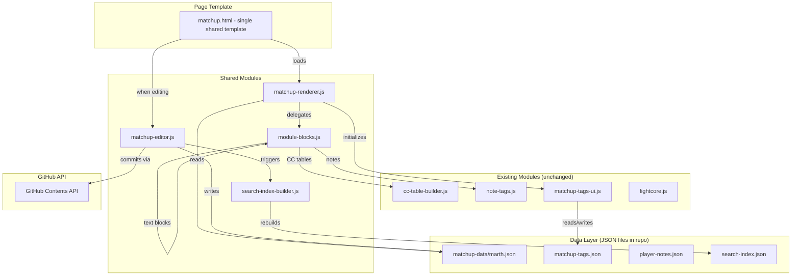
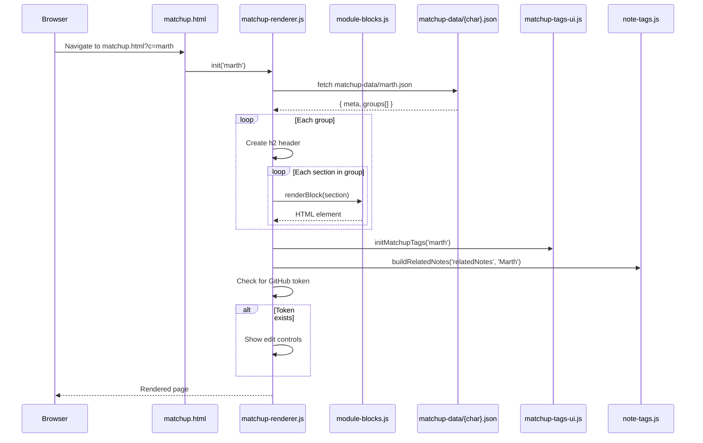
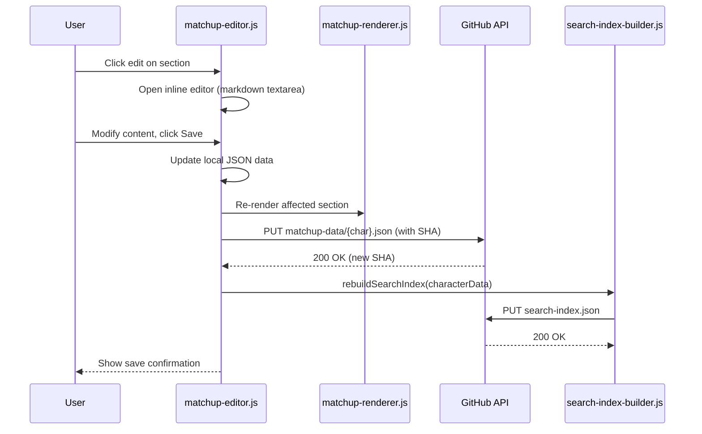
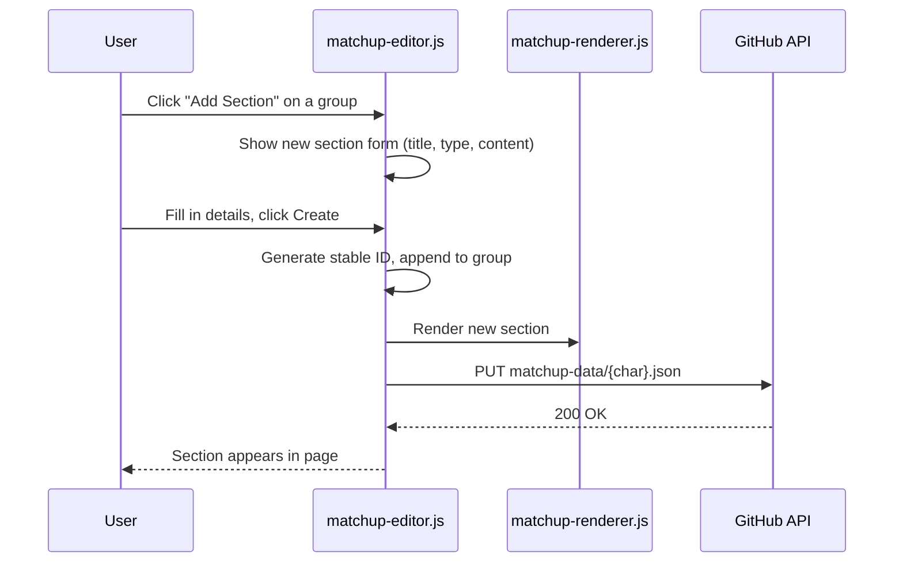

# Design Document: Modular Matchup Pages

## Overview

The modular matchup pages system converts the 16 hardcoded matchup HTML pages into a JSON-driven, browser-editable content system. Each "source-section" becomes a modular content block stored in `matchup-data/{character}.json`, rendered dynamically by a shared page template. Blocks can be added, edited, reordered, and deleted from the browser when a GitHub token is connected, with changes committed via the existing GitHub API sync system.

This design preserves all existing functionality — deep linking via stable IDs, per-section tagging, search indexing, related notes, CC/ASDI tables, OoS heatmaps — while making content editable without touching HTML. The JSON data format is designed to work for both the current GitHub Pages site and the future Electron desktop app.

The system introduces seven module types (text, VOD embed, calculator, CC/ASDI table, OoS heatmap, replay viewer, note reference) each with its own renderer, plus a migration script to convert existing HTML content into the new JSON format without data loss.

## Architecture



## Sequence Diagrams

### Page Load Flow



### Edit & Save Flow



### Add New Section Flow



## Components and Interfaces

### Component 1: matchup-renderer.js

**Purpose**: Reads a character's JSON data file and renders the full matchup page into the DOM. Delegates block rendering to module-blocks.js. Initializes tagging and notes modules.

**Interface**:
```javascript
/**
 * Initialize and render a matchup page.
 * @param {string} character - Character slug (e.g. 'marth', 'falco')
 * @param {HTMLElement} container - DOM element to render into
 * @returns {Promise<MatchupPageState>}
 */
export async function initMatchupPage(character, container) {}

/**
 * Re-render a single section after edit.
 * @param {string} sectionId - Stable section ID
 * @param {Section} sectionData - Updated section data
 */
export function rerenderSection(sectionId, sectionData) {}
```

**Responsibilities**:
- Fetch and parse `matchup-data/{character}.json`
- Render group headers (h2) and delegate section rendering to module-blocks.js
- Initialize matchup-tags-ui.js and note-tags.js
- Show/hide edit controls based on GitHub token presence
- Maintain in-memory state of the current page data for editing

### Component 2: matchup-editor.js

**Purpose**: Handles all editing operations — inline editing, adding/removing sections, reordering, and saving to GitHub. Only active when a GitHub token is connected.

**Interface**:
```javascript
/**
 * Initialize editor controls for a loaded matchup page.
 * @param {string} character - Character slug
 * @param {MatchupData} data - Parsed JSON data (mutable reference)
 * @param {Function} onSave - Callback after successful save
 */
export function initEditor(character, data, onSave) {}

/**
 * Open inline editor for a section.
 * @param {string} sectionId - Section to edit
 */
export function editSection(sectionId) {}

/**
 * Add a new section to a group.
 * @param {string} groupId - Target group ID
 * @param {string} type - Module type ('text', 'vod', 'calculator', etc.)
 */
export function addSection(groupId, type) {}

/**
 * Remove a section.
 * @param {string} sectionId - Section to remove
 */
export function removeSection(sectionId) {}

/**
 * Move a section up or down within its group.
 * @param {string} sectionId - Section to move
 * @param {'up'|'down'} direction
 */
export function moveSection(sectionId, direction) {}
```

**Responsibilities**:
- Inline markdown editing with live preview
- Section CRUD operations (add, edit, delete, reorder)
- Commit JSON changes to GitHub via the existing API pattern
- Trigger search index rebuild after save
- Permission gating (only show controls when `localStorage.getItem('gh_token')` exists)

### Component 3: module-blocks.js

**Purpose**: Registry of block renderers. Each module type has a render function that takes section data and returns a DOM element.

**Interface**:
```javascript
/**
 * Render a section block based on its type.
 * @param {Section} section - Section data from JSON
 * @param {object} context - { character, editable }
 * @returns {HTMLElement}
 */
export function renderBlock(section, context) {}

/**
 * Register a custom block renderer.
 * @param {string} type - Module type name
 * @param {Function} renderer - (section, context) => HTMLElement
 */
export function registerBlockType(type, renderer) {}
```

**Responsibilities**:
- Maintain a registry of block type → renderer function mappings
- Render text blocks (markdown → HTML)
- Render VOD embed blocks (YouTube/Twitch iframes with timestamps)
- Render calculator blocks (IKneeData embed with pre-filled params)
- Render CC/ASDI table blocks (delegate to cc-table-builder.js)
- Render OoS heatmap blocks (iframe to IKneeData)
- Render replay viewer blocks (link to replay at specific frame)
- Render note reference blocks (pull in player notes inline)

### Component 4: search-index-builder.js (browser-side)

**Purpose**: Rebuilds search-index.json from matchup JSON data after edits. Replaces the Python build script for browser-based editing.

**Interface**:
```javascript
/**
 * Rebuild search index for a single character and commit.
 * @param {string} character - Character slug
 * @param {MatchupData} data - Current character data
 * @returns {Promise<void>}
 */
export async function rebuildSearchIndex(character, data) {}
```

**Responsibilities**:
- Extract searchable text from all sections in a character's data
- Merge with existing search index entries (other characters unchanged)
- Commit updated search-index.json to GitHub

## Data Models

### MatchupData (per-character JSON file)

```javascript
/**
 * @typedef {Object} MatchupData
 * @property {MatchupMeta} meta - Page metadata
 * @property {Group[]} groups - Ordered array of section groups
 */

/**
 * @typedef {Object} MatchupMeta
 * @property {string} character - Character slug ('marth')
 * @property {string} displayName - Display name ('Marth')
 * @property {string} title - Page title ('Fox vs Marth')
 * @property {string} subtitle - Page subtitle ('Whiff punishing, juggling, and edgeguarding')
 * @property {string} icon - Character icon URL
 * @property {number} fightcoreId - FightCore character ID for CC tables
 */

/**
 * @typedef {Object} Group
 * @property {string} id - Stable group ID ('marth-overview')
 * @property {string} title - h2 header text ('Overview (Fox Deconstructed)')
 * @property {Section[]} sections - Ordered array of sections in this group
 */

/**
 * @typedef {Object} Section
 * @property {string} id - Stable section ID for deep linking ('marth-matchup-fundamentals')
 * @property {string} type - Module type: 'text' | 'vod' | 'calculator' | 'cc-table' | 'oos-heatmap' | 'replay' | 'note-ref'
 * @property {string} [title] - h3 title (optional, some sections are title-less)
 * @property {string} [content] - Markdown content (for text blocks)
 * @property {Object} [config] - Type-specific configuration
 * @property {string} [source] - Attribution ('Fox Deconstructed', 'BinaryClone', etc.)
 * @property {string[]} [crossRefs] - Array of cross-reference IDs (note IDs, replay IDs, etc.)
 */
```

**Example: matchup-data/marth.json**:
```json
{
  "meta": {
    "character": "marth",
    "displayName": "Marth",
    "title": "Fox vs Marth",
    "subtitle": "Whiff punishing, juggling, and edgeguarding",
    "icon": "https://i.imgur.com/HJT5ZTS.png",
    "fightcoreId": 9
  },
  "groups": [
    {
      "id": "marth-cc-asdi",
      "title": "CC / ASDI Down Reference",
      "sections": [
        {
          "id": "marth-cc-asdi-table",
          "type": "cc-table",
          "config": {
            "foxId": 2,
            "opponentId": 9,
            "opponentName": "Marth"
          }
        }
      ]
    },
    {
      "id": "marth-oos",
      "title": "Out of Shield Heatmap",
      "sections": [
        {
          "id": "marth-out-of-shield-heatmap",
          "type": "oos-heatmap",
          "config": {
            "character": "marth",
            "url": "https://ikneedata.com/heatmaps/oos/marth.html"
          }
        }
      ]
    },
    {
      "id": "marth-overview",
      "title": "Overview (Fox Deconstructed)",
      "sections": [
        {
          "id": "marth-matchup-fundamentals",
          "type": "text",
          "title": "Matchup Fundamentals",
          "content": "- Marth is really fast with an insane dash dance animation\n- Beating Marth involves making Marth whiff moves\n- Run in and make him have to protect himself (hopefully it means he swings)\n- Mix up run timing and possibly shield or CC last second when we are already in his face\n- The issue with trying to attack Marth is that you can always just get grabbed\n- Getting grabbed at high % isn't as bad, but still isn't good\n- It is hard for marth to grab you when you're not approaching",
          "source": "Fox Deconstructed"
        },
        {
          "id": "marth-preventing-marth-approach",
          "type": "text",
          "title": "Preventing Marth Approach",
          "content": "- Can prevent Marth approach with: lasers, platforms, and staying out of range\n- If he tries to slowly take stage with aerials and dtilt, this is where we can whiff punish\n- We need to know exactly where his sword ends every time he jumps\n- You still have to make a read after Marth misses an aerial\n- There are ways to hedge bets a little for punish\n- It is important to show Marth that you're willing to laser in place if they will just aerial in place\n- Marth's dash forward is the weakest part of the matchup\n- Make him respect that you're faster\n- Accept that everything he does has a mixup",
          "source": "Fox Deconstructed"
        }
      ]
    }
  ]
}
```

**Validation Rules**:
- `meta.character` must match the filename slug
- Every `section.id` must be unique within the file (used for deep linking)
- Every `group.id` must be unique within the file
- `section.type` must be one of the seven registered types
- `section.content` is required for `text` type, `section.config` is required for all other types
- IDs must be URL-safe (lowercase alphanumeric + hyphens)

### Module Config Schemas

```javascript
// CC/ASDI Table config
/** @typedef {{ foxId: number, opponentId: number, opponentName: string }} CCTableConfig */

// OoS Heatmap config
/** @typedef {{ character: string, url: string }} OoSHeatmapConfig */

// VOD Embed config
/** @typedef {{ platform: 'youtube'|'twitch', videoId: string, timestamp?: number, title?: string }} VodConfig */

// Calculator config
/** @typedef {{ attackerId?: number, defenderId?: number, move?: string, percent?: number }} CalculatorConfig */

// Replay Viewer config
/** @typedef {{ replayFile: string, frame?: number, description?: string }} ReplayConfig */

// Note Reference config
/** @typedef {{ noteId: string }} NoteRefConfig */
```

### Inline Move Linking (Cross-Cutting Feature)

Text blocks on matchup pages and player notes should auto-detect move names (e.g. "nair", "up smash", "shine", "drill") and render them as interactive links. On click/hover, a popup shows the move's frame data (from FightCore) and hitbox visualization (from ISO-extracted data when available). This is implemented as a post-processing step in the text block renderer — after markdown → HTML conversion, a `move-linker.js` module scans for known move terms and wraps them in `<span class="move-link">` elements with data attributes for character + move ID. The popup is rendered by a shared `move-popup.js` component that fetches data from `fightcore.js` and optionally from `hitbox-data/{character}.json`.

</text>
</invoke>


## Key Functions with Formal Specifications

### Function 1: initMatchupPage()

```javascript
async function initMatchupPage(character, container) {
  const data = await fetch(`matchup-data/${character}.json`).then(r => r.json());
  for (const group of data.groups) {
    const groupEl = createGroupElement(group.title, group.id);
    for (const section of group.sections) {
      const blockEl = renderBlock(section, { character, editable: !!getGhToken() });
      groupEl.appendChild(blockEl);
    }
    container.appendChild(groupEl);
  }
  initMatchupTags(character);
  buildRelatedNotes('relatedNotes', data.meta.displayName);
  return { character, data, container };
}
```

**Preconditions:**
- `character` is a valid character slug matching a file in `matchup-data/`
- `container` is a valid DOM element
- `matchup-data/{character}.json` exists and is valid JSON conforming to MatchupData schema

**Postconditions:**
- All groups and sections from the JSON are rendered in order into `container`
- Each section element has `id` attribute matching `section.id` (deep linking preserved)
- Tags and related notes modules are initialized
- Edit controls are visible if and only if `localStorage.getItem('gh_token')` is truthy
- No mutations to the source JSON data

### Function 2: renderBlock()

```javascript
function renderBlock(section, context) {
  const renderer = blockRegistry[section.type];
  if (!renderer) {
    return createFallbackBlock(section);
  }
  const el = renderer(section, context);
  el.id = section.id;
  el.classList.add('source-section');
  return el;
}
```

**Preconditions:**
- `section` has a valid `id` and `type` field
- `section.type` is one of: 'text', 'vod', 'calculator', 'cc-table', 'oos-heatmap', 'replay', 'note-ref'
- For 'text' type: `section.content` is a non-empty string
- For non-text types: `section.config` is a valid object for that type

**Postconditions:**
- Returns an HTMLElement with `id` set to `section.id`
- Element has class `source-section` (preserves existing CSS)
- If type is unrecognized, returns a fallback element (graceful degradation)
- No side effects beyond DOM element creation

### Function 3: saveMatchupData()

```javascript
async function saveMatchupData(character, data) {
  const token = getGhToken();
  const path = `matchup-data/${character}.json`;
  const content = btoa(unescape(encodeURIComponent(JSON.stringify(data, null, 2))));
  
  // Get current SHA
  const fileRes = await fetch(
    `https://api.github.com/repos/${GH_REPO}/contents/${path}?ref=${GH_BRANCH}&_=${Date.now()}`,
    { headers: { Authorization: `token ${token}`, Accept: 'application/vnd.github+json' } }
  );
  const sha = (await fileRes.json()).sha;
  
  // Commit update
  const putRes = await fetch(
    `https://api.github.com/repos/${GH_REPO}/contents/${path}`,
    {
      method: 'PUT',
      headers: { Authorization: `token ${token}`, Accept: 'application/vnd.github+json', 'Content-Type': 'application/json' },
      body: JSON.stringify({ message: `Update ${character} matchup data`, content, sha, branch: GH_BRANCH })
    }
  );
  if (!putRes.ok) throw new Error((await putRes.json()).message || putRes.status);
  return putRes.json();
}
```

**Preconditions:**
- `token` is a valid GitHub PAT with repo write access
- `data` conforms to MatchupData schema
- `matchup-data/{character}.json` exists in the repo (has a SHA to update against)
- Network connectivity to GitHub API

**Postconditions:**
- File is updated in the repo with new content
- Commit message includes character name
- Returns the GitHub API response (includes new SHA)
- If save fails, throws an Error with descriptive message
- No local state is modified on failure

### Function 4: migrateHtmlToJson()

```javascript
function migrateHtmlToJson(htmlString, character, meta) {
  const parser = new DOMParser();
  const doc = parser.parseFromString(htmlString, 'text/html');
  const groups = [];
  
  doc.querySelectorAll('.matchup-content').forEach(groupEl => {
    const h2 = groupEl.querySelector('h2');
    const groupTitle = h2 ? h2.textContent.trim() : 'Untitled';
    const groupId = character + '-' + groupTitle.toLowerCase().replace(/[^a-z0-9]+/g, '-').replace(/-+$/, '');
    const sections = [];
    
    groupEl.querySelectorAll('.source-section').forEach(sectionEl => {
      const section = parseSectionElement(sectionEl, character);
      sections.push(section);
    });
    
    groups.push({ id: groupId, title: groupTitle, sections });
  });
  
  return { meta, groups };
}
```

**Preconditions:**
- `htmlString` is a valid HTML document string containing `.matchup-content` and `.source-section` elements
- `character` is a valid character slug
- `meta` contains required MatchupMeta fields

**Postconditions:**
- Returns a valid MatchupData object
- All existing section IDs are preserved (deep links don't break)
- All bullet-point content is converted to markdown format
- Bold text (`<strong>`) is converted to `**bold**`
- Links (`<a>`) are converted to `[text](url)`
- Group ordering matches the original HTML document order
- Section ordering within groups matches original order
- Special sections (CC tables, OoS heatmaps) are detected and converted to their respective module types with correct config

**Loop Invariants:**
- After processing N groups, `groups.length === N` and all sections within those groups are fully converted
- No HTML content is lost during conversion

## Algorithmic Pseudocode

### Migration Algorithm

```javascript
// ALGORITHM: Convert all 16 matchup HTML pages to JSON
// INPUT: matchups/*.html files
// OUTPUT: matchup-data/*.json files

async function migrateAllMatchups() {
  const characters = [
    { slug: 'marth', displayName: 'Marth', fightcoreId: 9, icon: '...' },
    { slug: 'falco', displayName: 'Falco', fightcoreId: 20, icon: '...' },
    // ... all 16 characters
  ];
  
  for (const char of characters) {
    // Step 1: Read existing HTML
    const html = await fetch(`matchups/${char.slug}.html`).then(r => r.text());
    
    // Step 2: Parse into JSON structure
    const data = migrateHtmlToJson(html, char.slug, {
      character: char.slug,
      displayName: char.displayName,
      title: `Fox vs ${char.displayName}`,
      subtitle: extractSubtitle(html),
      icon: char.icon,
      fightcoreId: char.fightcoreId
    });
    
    // Step 3: Validate — every original section ID must exist in output
    const originalIds = extractSectionIds(html);
    const migratedIds = data.groups.flatMap(g => g.sections.map(s => s.id));
    const missing = originalIds.filter(id => !migratedIds.includes(id));
    if (missing.length > 0) {
      throw new Error(`Migration lost sections: ${missing.join(', ')}`);
    }
    
    // Step 4: Write JSON file
    await writeFile(`matchup-data/${char.slug}.json`, JSON.stringify(data, null, 2));
  }
}
```

### Section Type Detection Algorithm

```javascript
// ALGORITHM: Detect the module type of an HTML source-section
// INPUT: DOM element (.source-section)
// OUTPUT: { type, config? } identifying the module type

function detectSectionType(sectionEl) {
  // Check for CC/ASDI table (has .cc-asdi-toggle button)
  if (sectionEl.querySelector('.cc-asdi-toggle')) {
    return { type: 'cc-table' };
  }
  
  // Check for OoS heatmap (has iframe to ikneedata.com/heatmaps)
  const iframe = sectionEl.querySelector('iframe[src*="ikneedata.com/heatmaps"]');
  if (iframe) {
    return { type: 'oos-heatmap', config: { url: iframe.src } };
  }
  
  // Check for VOD embed (has iframe to youtube.com or twitch.tv)
  const vodIframe = sectionEl.querySelector('iframe[src*="youtube.com"], iframe[src*="twitch.tv"]');
  if (vodIframe) {
    return { type: 'vod', config: parseVodUrl(vodIframe.src) };
  }
  
  // Default: text block
  return { type: 'text' };
}
```

### Markdown Conversion Algorithm

```javascript
// ALGORITHM: Convert HTML bullet list content to markdown
// INPUT: innerHTML of a source-section (after h3)
// OUTPUT: markdown string

function htmlToMarkdown(html) {
  let md = html;
  
  // Convert <li> items to markdown bullets
  // Handle nested <strong> → **bold**
  md = md.replace(/<strong>(.*?)<\/strong>/g, '**$1**');
  
  // Handle <a href="...">text</a> → [text](url)
  md = md.replace(/<a\s+href="([^"]*)"[^>]*>(.*?)<\/a>/g, '[$2]($1)');
  
  // Handle <em> → *italic*
  md = md.replace(/<em>(.*?)<\/em>/g, '*$1*');
  
  // Extract list items
  const items = [];
  const liRegex = /<li>(.*?)<\/li>/gs;
  let match;
  while ((match = liRegex.exec(md)) !== null) {
    items.push('- ' + match[1].replace(/<[^>]+>/g, '').trim());
  }
  
  // If no list items found, strip tags and return as paragraph
  if (items.length === 0) {
    return md.replace(/<[^>]+>/g, '').trim();
  }
  
  return items.join('\n');
}
```

### Text Block Rendering Algorithm

```javascript
// ALGORITHM: Render markdown content as HTML for a text block
// INPUT: section.content (markdown string)
// OUTPUT: HTML string

function renderTextContent(markdown) {
  let html = markdown;
  
  // Bold: **text** → <strong>text</strong>
  html = html.replace(/\*\*(.*?)\*\*/g, '<strong>$1</strong>');
  
  // Italic: *text* → <em>text</em>
  html = html.replace(/(?<!\*)\*(?!\*)(.*?)(?<!\*)\*(?!\*)/g, '<em>$1</em>');
  
  // Links: [text](url) → <a href="url">text</a>
  html = html.replace(/\[([^\]]+)\]\(([^)]+)\)/g, '<a href="$2" target="_blank" style="color:#667eea;">$1</a>');
  
  // Bullet lists: lines starting with "- "
  const lines = html.split('\n');
  let inList = false;
  const result = [];
  
  for (const line of lines) {
    if (line.startsWith('- ')) {
      if (!inList) { result.push('<ul>'); inList = true; }
      result.push(`<li>${line.slice(2)}</li>`);
    } else {
      if (inList) { result.push('</ul>'); inList = false; }
      if (line.trim()) result.push(`<p>${line}</p>`);
    }
  }
  if (inList) result.push('</ul>');
  
  return result.join('\n');
}
```

## Example Usage

### Loading a matchup page (new template)

```javascript
// matchup.html — single shared template replaces all 16 HTML files
import { initMatchupPage } from './matchup-renderer.js';

// Get character from URL: matchup.html?c=marth
const params = new URLSearchParams(location.search);
const character = params.get('c');

if (character) {
  const container = document.querySelector('main.container');
  initMatchupPage(character, container);
}
```

### Editing a section

```javascript
// When user clicks edit button on a section
import { editSection, saveMatchupData } from './matchup-editor.js';

function onEditClick(sectionId) {
  editSection(sectionId);
  // Opens inline textarea with markdown content
  // User edits, clicks save
  // Editor updates local data, re-renders section, commits to GitHub
}
```

### Adding a new VOD embed section

```javascript
import { addSection } from './matchup-editor.js';

// Add a VOD embed to the "Edgeguarding" group
addSection('marth-edgeguarding', 'vod');
// Opens form: paste YouTube URL, set title
// Creates section: { id: 'marth-edgeguard-vod-1', type: 'vod', title: 'Mango Marth Killer Example', config: { platform: 'youtube', videoId: 'abc123', timestamp: 45 } }
```

### Running the migration script

```javascript
// One-time migration: run in browser console or as a Node script
import { migrateAllMatchups } from './migrate-matchups.js';

await migrateAllMatchups();
// Reads all 16 matchups/*.html files
// Outputs matchup-data/*.json files
// Validates no section IDs were lost
```

## Correctness Properties

*A property is a characteristic or behavior that should hold true across all valid executions of a system — essentially, a formal statement about what the system should do. Properties serve as the bridge between human-readable specifications and machine-verifiable correctness guarantees.*

### Property 1: Rendering Order Invariant

*For any* valid MatchupData object, the Renderer SHALL produce DOM elements where groups appear in the same order as the `groups` array, and sections within each group appear in the same order as the `sections` array. All groups and sections in the data must be present in the rendered output.

**Validates: Requirements 1.1, 1.2, 1.3**

### Property 2: Section ID Preservation in DOM

*For any* Section with a non-empty `id` field, the rendered DOM element SHALL have its `id` attribute set to that exact value, so that `document.getElementById(section.id)` returns the rendered element.

**Validates: Requirements 1.5, 10.1**

### Property 3: Permission Gating

*For any* rendered matchup page, edit controls (edit, add, delete, reorder buttons) SHALL be visible if and only if `localStorage.getItem('gh_token')` returns a truthy value. When no token is present, zero edit controls appear in the DOM and all editing operations are rejected.

**Validates: Requirements 1.6, 1.7, 4.4**

### Property 4: Graceful Degradation for Unknown Block Types

*For any* Section whose `type` field does not match a registered Module_Type, the Block_Registry SHALL return a valid HTMLElement containing a fallback message that includes the unrecognized type name, rather than throwing an error.

**Validates: Requirement 2.8**

### Property 5: CSS Class Invariant

*For any* Section of any type, the Block_Registry SHALL assign the class `source-section` to the rendered block element.

**Validates: Requirement 2.9**

### Property 6: Markdown Round-Trip

*For any* valid markdown string containing bullet lists, bold markers, italic markers, and link patterns, converting to HTML via `renderTextContent()` and then back to markdown via `htmlToMarkdown()` SHALL produce content with the same bullet items, bold segments, italic segments, and link targets as the original.

**Validates: Requirements 3.1, 3.2, 3.3, 3.4, 3.5, 8.2**

### Property 7: Section Reorder Correctness

*For any* group with N sections and any valid move operation (up or down), the resulting section order SHALL match the expected permutation — moving section at index i up swaps it with index i-1, moving down swaps with i+1, and boundary moves are no-ops.

**Validates: Requirement 5.3**

### Property 8: Generated IDs are URL-Safe and Unique

*For any* newly added section, the generated Section_ID SHALL contain only lowercase alphanumeric characters and hyphens, and SHALL be unique within the MatchupData file.

**Validates: Requirements 5.1, 9.5**

### Property 9: Search Index Consistency

*For any* MatchupData after a successful save, the Search_Index_Builder SHALL produce search index entries where every section's text content is represented, and entries for other characters remain unmodified.

**Validates: Requirements 7.2, 7.3**

### Property 10: Migration Losslessness

*For any* matchup HTML file containing `.matchup-content` groups and `.source-section` elements, the Migration_Script SHALL produce a valid MatchupData object where every original Section_ID is preserved exactly, group and section ordering matches the original HTML, and no content is lost.

**Validates: Requirements 8.1, 8.3, 8.5, 10.3**

### Property 11: Migration Type Detection

*For any* HTML `.source-section` element containing a CC/ASDI table toggle, an IKneeData heatmap iframe, or a YouTube/Twitch iframe, the Migration_Script SHALL assign the correct Module_Type (`cc-table`, `oos-heatmap`, or `vod` respectively) with appropriate config. All other sections SHALL be assigned type `text`.

**Validates: Requirement 8.4**

### Property 12: Validation Rejects Invalid Data

*For any* MatchupData containing duplicate Section_IDs, unregistered type values, text sections with empty content, non-text sections without a config object, or IDs with non-URL-safe characters, the Renderer's validation SHALL reject the data and report the specific violations.

**Validates: Requirements 9.1, 9.2, 9.3, 9.4**

### Property 13: Edit Idempotency

*For any* valid MatchupData, loading the data and saving it without modifications SHALL produce identical JSON output (modulo whitespace). `save(load(data)) === data`.

**Validates: Requirements 4.2, 6.2**

## Error Handling

### Error Scenario 1: JSON Fetch Failure

**Condition**: `matchup-data/{character}.json` fails to load (404, network error, invalid JSON)
**Response**: Display a user-friendly error message in the container. Log the error to console.
**Recovery**: Show a "Retry" button. If the file doesn't exist yet (pre-migration), show a message explaining the page hasn't been migrated.

### Error Scenario 2: GitHub Save Failure

**Condition**: PUT request to GitHub API fails (401 unauthorized, 409 conflict, network error)
**Response**: Show error toast with the specific failure reason. Do not discard the user's edits.
**Recovery**: Keep the edited content in the textarea. User can retry. On 409 (SHA conflict), re-fetch the current SHA and retry automatically.

### Error Scenario 3: Unrecognized Block Type

**Condition**: JSON contains a section with a `type` value not in the block registry
**Response**: Render a fallback block showing the section title and a message: "Unknown block type: {type}"
**Recovery**: The section data is preserved in JSON. When the block type renderer is added later, it will render correctly.

### Error Scenario 4: Migration Data Loss

**Condition**: Migration script detects that some section IDs from the original HTML are missing in the output JSON
**Response**: Throw an error listing the missing section IDs. Do not write the output file.
**Recovery**: Fix the migration parser to handle the edge case, then re-run.

### Error Scenario 5: Concurrent Edit Conflict

**Condition**: Two browser tabs edit the same character's data simultaneously
**Response**: Second save gets a 409 from GitHub (SHA mismatch)
**Recovery**: Re-fetch the latest JSON, merge changes if possible (different sections), or prompt user to resolve conflict.

## Testing Strategy

### Unit Testing Approach

- Test `htmlToMarkdown()` with various HTML inputs: simple bullets, nested bold, links, empty sections
- Test `renderTextContent()` round-trip: markdown → HTML → verify structure
- Test `detectSectionType()` with each known section pattern (CC table, OoS heatmap, VOD, text)
- Test `migrateHtmlToJson()` with a sample matchup HTML file, verify all IDs preserved
- Test ID generation: verify uniqueness, URL-safety, stability across re-runs

### Property-Based Testing Approach

**Property Test Library**: fast-check

- **Round-trip property**: For any valid markdown string, `htmlToMarkdown(renderTextContent(md))` should produce equivalent content (same bullet items, same bold/link markers)
- **ID uniqueness property**: For any generated MatchupData, all section IDs across all groups are unique
- **Ordering property**: For any sequence of move operations (moveSection up/down), the resulting order matches the expected permutation

### Integration Testing Approach

- Test full page load: fetch JSON → render → verify DOM structure matches expected output
- Test edit flow: load page → edit section → save → reload → verify content persisted
- Test migration: run migration on actual matchup HTML files → verify output JSON → render from JSON → compare visual output
- Test search index rebuild: edit a section → verify search-index.json updated correctly
- Test deep linking: navigate to URL with `#section-id` → verify scroll to correct section

## Performance Considerations

- JSON files are small (each character's data is ~5-20KB) — no lazy loading needed
- Markdown rendering is done client-side with a lightweight custom parser (no heavy library dependency)
- CC/ASDI tables and OoS heatmaps already lazy-load their data — no change needed
- Search index rebuild only updates entries for the edited character, not the full index
- The migration script runs once and can be run locally — not a runtime concern

## Security Considerations

- GitHub PAT token is stored in `localStorage` (existing pattern, unchanged)
- Edit controls are only rendered when token exists — no server-side auth needed for a static site
- All GitHub API calls use the token from localStorage, same as the existing notes system
- Content is markdown with a limited renderer (no raw HTML injection in rendered output)
- The `renderTextContent()` function does not use `innerHTML` with unsanitized user input — it constructs elements from parsed markdown tokens

## Dependencies

- **Existing modules (unchanged)**: `cc-table-builder.js`, `fightcore.js`, `note-tags.js`, `matchup-tags-ui.js`
- **GitHub Contents API**: For reading/writing JSON files (existing pattern)
- **DOMParser**: For HTML → JSON migration (built-in browser API)
- **No new external libraries**: The markdown parser is a lightweight custom implementation supporting only the subset needed (bullets, bold, italic, links)

## Already Implemented Features (Post-Design)

The following features have been built since this design was created and must be preserved/integrated:

### Search System (way-of-fox.html)
- **Prefix-based search**: `marth:`, `doubles:`, `singles:`, `fox:`, `concepts:`, `title:`, `author:` prefixes scope results
- **Search dropdown**: Dark-themed dropdown with content previews, deep links to sections
- **Search index**: `search-index.json` with 456+ sections from all matchup pages + concepts.html
- **`build-search-index.py`**: Python script to rebuild the index (must be replaced by browser-side `search-index-builder.js` after migration)

### Tagging System
- **Per-section tags**: `matchup-tags.json` stores tags keyed by `matchup/section-slug`
- **`matchup-tags-ui.js`**: Adds tag buttons + share buttons to every `.source-section` on all pages
- **Tag filter on notes page**: Notes have `tags[]` array, filterable in the notes UI

### Share System
- **Section deep linking**: Every `.source-section` has a stable `id` attribute
- **Share buttons**: Each section has a 🔗 share button that copies `page.html#section-id`
- **Hash scroll**: `matchup-tags-ui.js` scrolls to and highlights sections on hash navigation

### Note VODs in Replay Browser
- VODs attached to player notes now appear in the "Saved Replays" browser with purple border and "from: player" label

### GitHub API Sync
- Notes auto-sync via GitHub Contents API with named commit messages
- Matchup tags sync via the same mechanism
- Token stored in `localStorage`, shared across all pages on the domain

### Concepts & Doubles Pages
- `concepts.html` has section IDs, tagging, sharing, and is indexed in search
- `matchups/doubles.html` has section IDs, tagging, sharing, related notes, and is indexed in search

### Integration Notes for Migration
- The migration must preserve all existing section IDs (deep links + share links already in use)
- `matchup-tags.json` keys reference section IDs — these must not change
- The search index format must remain compatible with the Way of Fox search dropdown
- The `author:` prefix search relies on h2 headers containing author names — the `source` field in the JSON schema maps to this

## URL Routing Strategy

The current system has 16 separate HTML files (`matchups/marth.html`, `matchups/falco.html`, etc.). The migration path:

1. **Phase 1 (Migration)**: Create `matchup-data/*.json` files alongside existing HTML pages. HTML pages still work.
2. **Phase 2 (Template)**: Create `matchup.html?c={character}` as the new shared template. Both old and new URLs work.
3. **Phase 3 (Redirect)**: Old `matchups/{character}.html` pages redirect to `matchup.html?c={character}`. Or keep both working indefinitely since it's a static site.

This phased approach means no existing links break at any point.

## Electron App Compatibility

The JSON data format is designed to work in both environments:
- **Web (GitHub Pages)**: JSON files fetched via HTTP, saved via GitHub API
- **Electron (future)**: JSON files read/written directly from filesystem

The `matchup-renderer.js` and `module-blocks.js` modules are pure DOM rendering — they work in both Electron's renderer process and a browser. Only the save mechanism differs, which can be abstracted behind a simple interface:

```javascript
// Storage interface — swap implementation per environment
const storage = {
  async load(character) { /* fetch or fs.readFile */ },
  async save(character, data) { /* GitHub API or fs.writeFile */ }
};
```
